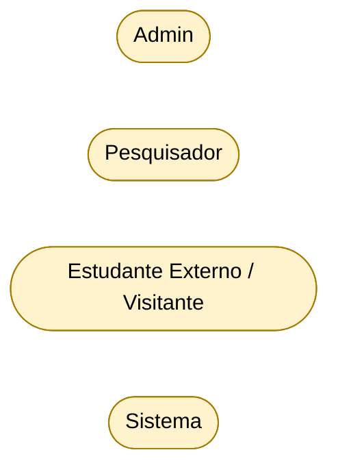
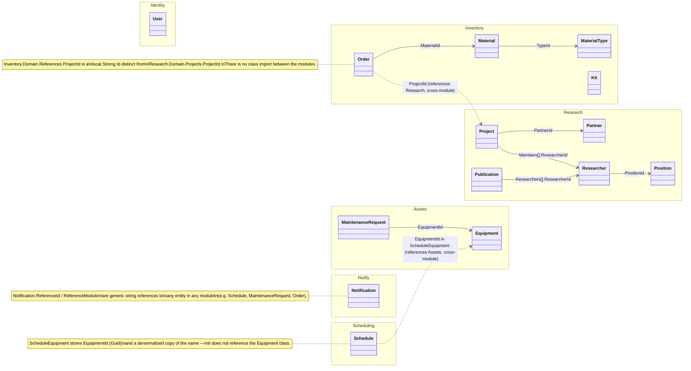

# Cross-Module Overview — LabViroMol

**English** · [Português](./cross-module-overview.pt-BR.md)

This page gathers what crosses module boundaries — the system's actors, the relationships between aggregate roots of different modules, and the data references that link schemas without a database foreign key. Per-module detail (use cases, classes, full ER diagrams) lives in `src/Modules/<Module>/docs/`; here you'll find only the excerpt that a single module diagram does not show.

All diagrams are Mermaid and reflect the real code (Domain layer and persistence configurations).

## Actors

Four actors interact with the system. In the per-module use case diagrams they reappear already linked to operations; below they are only described.

| Actor                              | Type                                 | Description                                                                                                                                                                                                                                                                                                                                                                                                   |
| ---------------------------------- | ------------------------------------- | ----------------------------------------------------------------------------------------------------------------------------------------------------------------------------------------------------------------------------------------------------------------------------------------------------------------------------------------------------------------------------------------------------------------- |
| **Admin**                         | Human (authenticated, Angular panel) | Internal user authenticated via JWT, with `*.Manage`/`*.View` permissions according to the assigned Role. Covers management operations for Identity, Inventory, Assets, Research and Scheduling.                                                                                                                                                                                                                      |
| **Researcher**                   | Human/Domain                       | Represented by the `Researcher` entity (Research module). Participates in Projects (`ProjectMember`/`ProjectRole`: `ResearchLead`, `Manager`, `Collaborator`) and Publications. Project lifecycle operations (start/complete/cancel/transfer leadership/manage members) depend on the Researcher's identity (`ResearchLead`), typically triggered via Admin on their behalf (`RequestedById`). |
| **External Student / Visitor** | Human (anonymous, Next.js site)       | Unauthenticated user of the institutional site. Consumes public endpoints (`/api/*/public/...`) and can request lab usage scheduling.                                                                                                                                                                                                                                                         |
| **System**                       | Non-human                           | Automatic processes triggered by Domain Events (e.g. `LowStockDomainEvent`, `NewScheduleDomainEvent`, `OrderReceivedDomainEvent`, `ApprovedScheduleDomainEvent`) that generate internal notifications (`ISendNotification`) and automatic e-mails (`ISendEmail`).                                                                                                                                            |

The detailed use case diagram for each module, with the Actor → Permissions table, is in `src/Modules/<Module>/docs/use-case-diagram.md`.

## Domain — aggregate roots and cross-module relationships

The 14 aggregate roots grouped by module, showing associations within the same module and, with a dashed line, the weak dependencies that cross modules (made by Id, with no class import). Attributes, value objects and enums for each aggregate are in the per-module class diagrams.

Per-module detail, including the Shared Kernel and the cross-module contracts (`IProjectChecker`, `IProjectCatalog`, `IResearcherProfileProvider`, `ISendNotification`, `ISendEmail`), is in `src/Modules/<Module>/docs/class-diagram.md` and `src/Modules/Shared/docs/class-diagram.md`.

## Data — cross-module references without FK

In the database (multi-schema PostgreSQL), the columns below physically exist as `uuid` (or `string`, in the case of `Notification`) but **have no FK constraint**, because they reference a table in another schema — the intentional decoupling between bounded contexts. *Intra-schema* references have a real FK and are documented in the per-module ER diagrams, not here. The rationale behind each decoupling (Conformist / Anti-Corruption Layer via contract) is in the [Context Map](./context-map/context-map.md).

| Table.Column | Source schema | Referenced schema/table (logically) | Reason for missing FK |
|---|---|---|---|
| `inventory.InventoryOrders.ProjectId` | inventory | `research.Projects` | cross-module |
| `inventory.StockTransactions.ProjectId` | inventory | `research.Projects` | cross-module |
| `scheduling.ScheduleEquipments.EquipmentId` | scheduling | `assets.Equipments` | cross-module |
| `notify.Notifications.ReferenceId`/`ReferenceModule` | notify | any module (generic, as string) | cross-module, maximum decoupling |
| `notify.NotificationDismissals.UserId` | notify | `identity.Users`/`IdentityUsers` | cross-module |
| `identity.Users.Id` ↔ `identity.IdentityUsers.Id` | identity | identity (same schema) | same Guid value by application convention, not FK |

The full ER diagram for each schema is in `src/Modules/<Module>/docs/er-diagram.md`.
