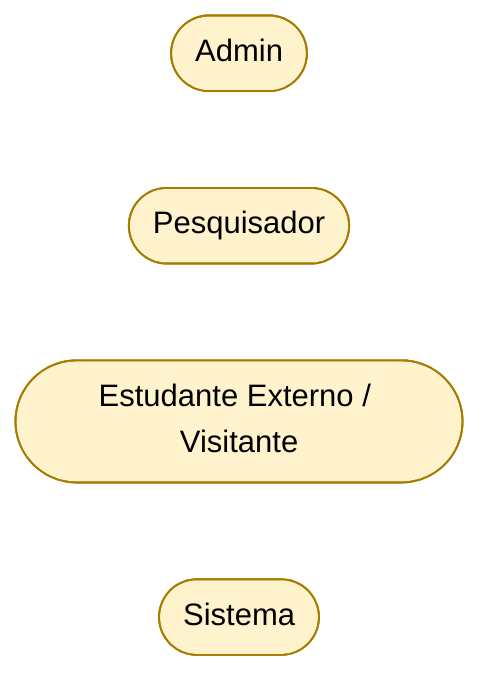
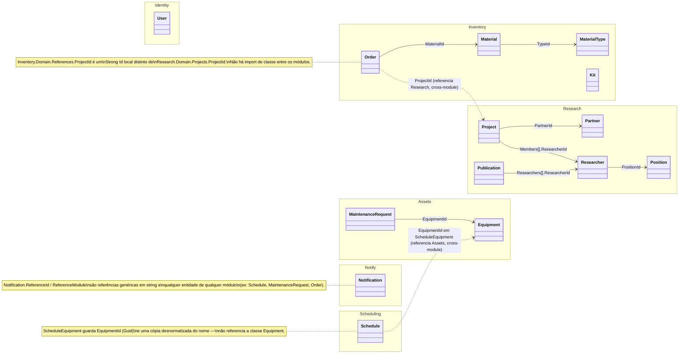

# Visão Cross-Module — LabViroMol

[English](./cross-module-overview.md) · **Português**

Esta página reúne o que atravessa as fronteiras de módulo — os atores do sistema, as relações entre os aggregate roots de módulos diferentes e as referências de dados que ligam schemas sem chave estrangeira de banco. O detalhe de cada módulo (casos de uso, classes, ER completos) fica em `src/Modules/<Modulo>/docs/`; aqui só está o recorte que um diagrama de módulo isolado não mostra.

Todos os diagramas são Mermaid e refletem o código real (camada Domain e configurações de persistência).

## Atores

Quatro atores interagem com o sistema. Nos diagramas de caso de uso por módulo eles reaparecem já ligados às operações; abaixo estão apenas descritos.

| Ator                              | Tipo                                 | Descrição                                                                                                                                                                                                                                                                                                                                                                                                   |
| ---------------------------------- | ------------------------------------- | ----------------------------------------------------------------------------------------------------------------------------------------------------------------------------------------------------------------------------------------------------------------------------------------------------------------------------------------------------------------------------------------------------------- |
| **Admin**                         | Humano (autenticado, painel Angular) | Usuário interno autenticado via JWT, com permissões `*.Manage`/`*.View` conforme o Role atribuído. Cobre as operações de gestão de Identity, Inventory, Assets, Research e Scheduling.                                                                                                                                                                                                                      |
| **Pesquisador**                   | Humano/Domínio                       | Representado pela entidade `Researcher` (módulo Research). Participa de Projetos (`ProjectMember`/`ProjectRole`: `ResearchLead`, `Manager`, `Collaborator`) e Publicações. Operações de ciclo de vida de projeto (iniciar/concluir/cancelar/transferir liderança/gerenciar membros) dependem da identidade do Pesquisador (`ResearchLead`), tipicamente disparadas via Admin em seu nome (`RequestedById`). |
| **Estudante Externo / Visitante** | Humano (anônimo, site Next.js)       | Usuário não autenticado do site institucional. Consome endpoints públicos (`/api/*/public/...`) e pode solicitar agendamento de uso do laboratório.                                                                                                                                                                                                                                                         |
| **Sistema**                       | Não humano                           | Processos automáticos disparados por Domain Events (ex.: `LowStockDomainEvent`, `NewScheduleDomainEvent`, `OrderReceivedDomainEvent`, `ApprovedScheduleDomainEvent`) que geram notificações internas (`ISendNotification`) e e-mails automáticos (`ISendEmail`).                                                                                                                                            |

O caso de uso detalhado de cada módulo, com a tabela Ator → Permissões, está em `src/Modules/<Modulo>/docs/use-case-diagram.md`.

## Domínio — aggregate roots e relações entre módulos

As 14 aggregate roots agrupadas por módulo, mostrando as associações dentro do mesmo módulo e, com linha tracejada, as dependências fracas que cruzam módulos (feitas por Id, sem import de classe). Atributos, value objects e enums de cada agregado estão nos diagramas de classe por módulo.

O detalhe por módulo, incluindo o Shared Kernel e os contratos cross-module (`IProjectChecker`, `IProjectCatalog`, `IResearcherProfileProvider`, `ISendNotification`, `ISendEmail`), está em `src/Modules/<Modulo>/docs/class-diagram.md` e `src/Modules/Shared/docs/class-diagram.md`.

## Dados — referências cross-module sem FK

No banco (PostgreSQL multi-schema), as colunas abaixo existem fisicamente como `uuid` (ou `string`, no caso de `Notification`) mas **não têm constraint de FK**, porque referenciam uma tabela de outro schema — o desacoplamento intencional entre bounded contexts. As referências *intra-schema* têm FK real e estão nos ER por módulo, não aqui. O racional de cada desacoplamento (Conformist / Anti-Corruption Layer por contrato) está no [Mapa de Contexto](./context-map/context-map.pt-BR.md).

| Tabela.Coluna | Schema de origem | Schema/tabela referenciada (logicamente) | Motivo da ausência de FK |
|---|---|---|---|
| `inventory.InventoryOrders.ProjectId` | inventory | `research.Projects` | cross-module |
| `inventory.StockTransactions.ProjectId` | inventory | `research.Projects` | cross-module |
| `scheduling.ScheduleEquipments.EquipmentId` | scheduling | `assets.Equipments` | cross-module |
| `notify.Notifications.ReferenceId`/`ReferenceModule` | notify | qualquer módulo (genérico, em string) | cross-module, desacoplamento máximo |
| `notify.NotificationDismissals.UserId` | notify | `identity.Users`/`IdentityUsers` | cross-module |
| `identity.Users.Id` ↔ `identity.IdentityUsers.Id` | identity | identity (mesmo schema) | mesmo valor de Guid por convenção de aplicação, não FK |

O ER completo de cada schema está em `src/Modules/<Modulo>/docs/er-diagram.md`.
