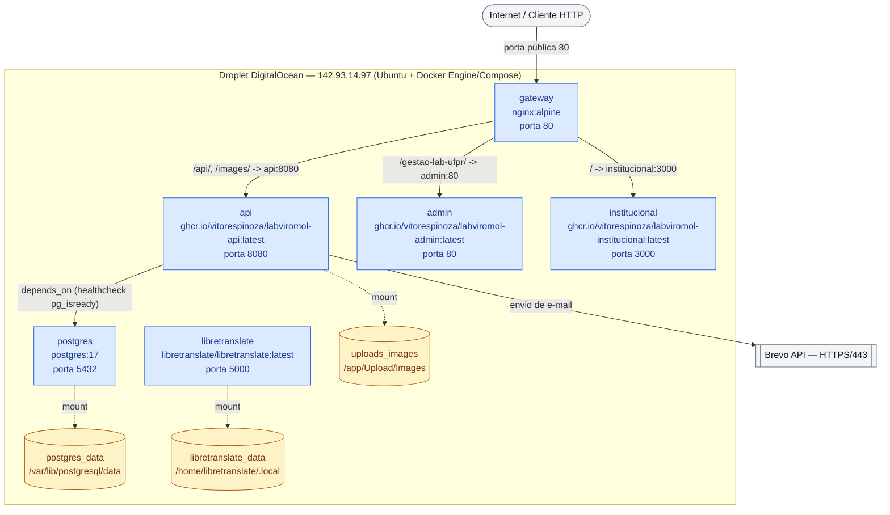

# Deployment Diagram — LabViroMol

**English** · [Português](./deployment.pt-BR.md)

This diagram shows the actual physical/infrastructure topology of LabViroMol in production: a single node (DigitalOcean droplet) running the 6 Docker containers defined in `docker-compose.yaml`, the 3 persistent volumes, and the single public port exposed to the outside world. It complements C4 Level 2 (Container, see `docs/architecture/c4-model/c4-container.md`) with the perspective of **where this runs**, not how the components communicate logically.

The styled `flowchart TB` notation was chosen (instead of native `C4Deployment`) to prioritize rendering fidelity: dedicated C4 deployment blocks are rarely used and have less consistent support across Mermaid tools, while `flowchart` with `subgraph` is broadly supported and lets us represent physical node, containers and volumes with the same level of detail.

**Notes on the deployment strategy:**

- The `api`, `admin` and `institucional` images are published to GHCR (GitHub Container Registry) by the CI pipeline; the production update is done manually on the droplet via `docker compose pull && docker compose up -d`.
- `postgres` and `libretranslate` are not publicly exposed: all communication between them and the other containers happens on the compose's standard internal Docker network (the `default` network). The current `docker-compose.yaml` still publishes `5432:5432` and `5000:5000` on the host for operational convenience (administrative access via SSH tunnel/firewall), but none of these ports is reachable from the Internet — only port `80` on the `gateway` is publicly exposed.
- `gateway` depends on `api`, `admin` and `institucional` being available before it starts routing; `api` depends on the `pg_isready` healthcheck of `postgres`.
