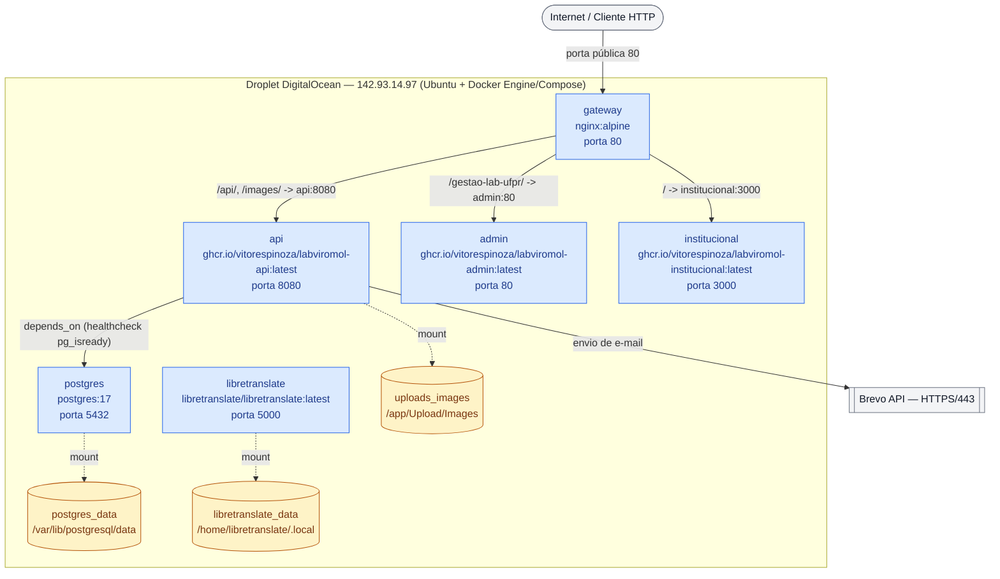

# Diagrama de Implantação (Deployment) — LabViroMol

[English](./deployment.md) · **Português**

Este diagrama mostra a topologia física/de infraestrutura real em produção do LabViroMol: um único nó (droplet DigitalOcean) executando os 6 containers Docker definidos em `docker-compose.yaml`, os 3 volumes persistentes, e a única porta pública exposta ao mundo externo. Ele complementa o C4 Nível 2 (Container, ver `docs/architecture/c4-model/c4-container.md`) com a perspectiva de **onde isso roda**, não de como os componentes se comunicam logicamente.

Optou-se pela notação `flowchart TB` estilizada (em vez de `C4Deployment` nativo) para priorizar fidelidade de renderização: blocos C4 dedicados a deployment são pouco usados e têm suporte menos consistente entre ferramentas Mermaid, enquanto `flowchart` com `subgraph` é amplamente suportado e permite representar nó físico, containers e volumes com o mesmo nível de detalhe.

**Notas sobre a estratégia de deploy:**

- As imagens de `api`, `admin` e `institucional` são publicadas no GHCR (GitHub Container Registry) por pipeline CI; a atualização em produção é feita manualmente no droplet via `docker compose pull && docker compose up -d`.
- `postgres` e `libretranslate` não são expostos publicamente: toda comunicação entre eles e os demais containers ocorre na rede Docker interna padrão do compose (rede `default`). O `docker-compose.yaml` atual ainda publica `5432:5432` e `5000:5000` no host por conveniência operacional (acesso administrativo via SSH tunnel/firewall), mas nenhuma dessas portas é acessível pela Internet — apenas a porta `80` do `gateway` é exposta publicamente.
- `gateway` depende de `api`, `admin` e `institucional` estarem disponíveis antes de iniciar o roteamento; `api` depende do healthcheck `pg_isready` do `postgres`.
