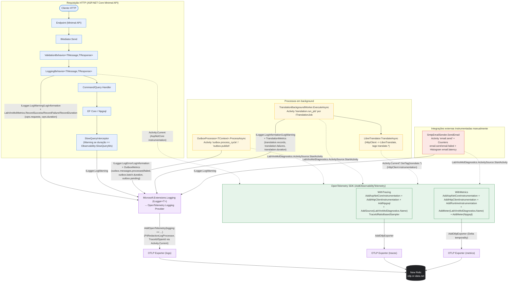

# Observability Overview — LabViroMol

**English** · [Português](./observability-overview.pt-BR.md)

This document shows the actual telemetry flow implemented in the observability initiative:
how an HTTP request, an Outbox cycle and a background translation job generate structured
logs (`ILogger<T>` + OpenTelemetry provider), metrics and spans (OpenTelemetry SDK), and how
everything converges into the same OTLP exporter toward New Relic. The configuration of the
whole pipeline is in `src/Modules/Shared/Infrastructure/Observability/ObservabilityExtensions.cs`.

Sources used for this diagram: `ObservabilityExtensions.cs`,
`src/Modules/Shared/Infrastructure/Behaviors/{ValidationBehavior,LoggingBehavior}.cs`,
`src/Modules/Shared/Infrastructure/Observability/{LabViroMolDiagnostics,SlowQueryInterceptor}.cs`,
`src/Modules/Shared/Infrastructure/Persistence/Outbox/OutboxProcessor.cs`,
`src/Modules/Shared/Infrastructure/Translation/{TranslationBackgroundWorker,LibreTranslator}.cs`,
`src/Modules/Notify/Infrastructure/Emails/SendEmail.cs` (the `SmtpEmailSender` class).

## Diagram

## Legend

- **HTTP pipeline** (blue): every request goes through the Mediator before the handler —
  `ValidationBehavior` runs first (a validation failure short-circuits the pipeline via
  `Result.Validation`), `LoggingBehavior` wraps the handler execution with a `Stopwatch`,
  always recording `cqrs.duration` (Histogram), and `cqrs.requests` as success/failure
  (`outcome=success|failure`, `error_type` in the failure case) — see `LoggingBehavior.cs`.
  `SlowQueryInterceptor` (registered per module via `AddSlowQueryLogging`) logs at `Warning`
  level when an EF Core/Npgsql query exceeds `Observability:SlowQueryMs` (default 500ms).
- **Background** (yellow): `OutboxProcessor<TContext>` opens one `Activity` per cycle
  (`outbox.process_cycle`) and one per published message (`outbox.publish`), reporting
  `outbox.messages.processed`/`outbox.messages.failed` (Counter), `outbox.batch.duration`
  (Histogram) and `outbox.pending` (Gauge). `TranslationBackgroundWorker` opens one `Activity`
  (`translation.run_job`) per `ITranslationJob` executed and reports `translation.records`,
  `translation.failures`, `translation.duration`; the actual HTTP call to LibreTranslate
  (`LibreTranslator.TranslateAsync`) adds tags (`translate.source_lang`, `translate.target_lang`,
  `translate.text_length`) to the current `Activity`, without opening its own.
  - Small fidelity note: `LibreTranslator` uses `Activity.Current` (the `Activity` opened by
    the worker), not `LabViroMolDiagnostics.ActivitySource` directly — that's why the dotted
    arrow from `LibreHttp` to the SDK represents the continuation of the same span, not a new one.
- **Manually instrumented external integration** (red): `SmtpEmailSender.SendEmail` opens
  `Activity("email.send", ActivityKind.Producer)` and uses its own `Counter<long>`/`Histogram<double>`
  (`email.sent`, `email.failed`, `email.latency`) created directly on
  `LabViroMolDiagnostics.Meter`, outside the `LabViroMolMetrics`/`OutboxMetrics`/`TranslationMetrics`
  pattern used by the other components.
- **Microsoft.Extensions.Logging → OpenTelemetry Logging Provider** (purple) is the only logging
  path used by the application (`builder.Logging.AddOpenTelemetry(...)`); it always writes to
  the console (MEL's default provider) and, when an OTLP endpoint is configured
  (`OpenTelemetry:OtlpEndpoint` or `OTEL_EXPORTER_OTLP_ENDPOINT`), also via `AddOtlpExporter`,
  including automatic `TraceId`/`SpanId` via `Activity.Current` for log↔trace correlation.
  `PiiRedactionLogProcessor` runs as an `AddProcessor(...)`, redacting sensitive attributes
  before export. HTTP request timing does not generate a dedicated log — it lives only as
  span attributes (`AddAspNetCoreInstrumentation`).
- **OpenTelemetry SDK** (green) is configured once in `AddObservabilityTelemetry`: tracing with
  `TraceIdRatioBasedSampler` (rate configurable via `OpenTelemetry:Tracing:SamplingRatio`,
  default 1.0) and automatic ASP.NET Core/HttpClient/Npgsql instrumentation, plus its own
  `ActivitySource` (`LabViroMolDiagnostics.Name = "LabViroMol"`); metrics with automatic
  ASP.NET Core/HttpClient/Runtime instrumentation and its own `Meter` (same name), exported
  with `MetricReaderTemporalityPreference.Delta` (a New Relic requirement).
- **OTLP Exporters → New Relic** (black): logs, traces and metrics all converge on the same
  OTLP endpoint resolved by `ResolveOtlpEndpoint` (`OpenTelemetry:OtlpEndpoint` in appsettings,
  falling back to the `OTEL_EXPORTER_OTLP_ENDPOINT` env var) — with no endpoint configured, no
  OTLP exporter/sink is registered and the API still starts up normally with only console logging.
