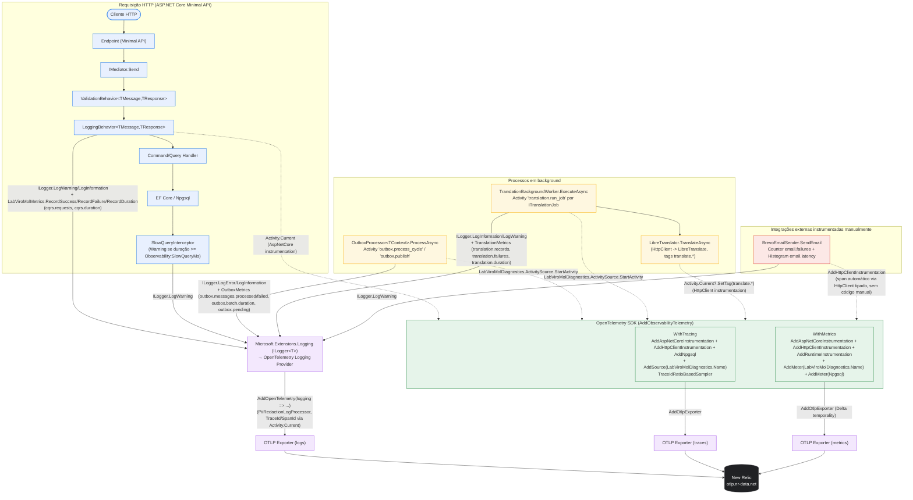

# Visão Geral de Observabilidade — LabViroMol

[English](./observability-overview.md) · **Português**

Este documento mostra o fluxo real de telemetria implementado na iniciativa de observabilidade:
como uma requisição HTTP, um ciclo do Outbox e um job de tradução em background geram logs
estruturados (`ILogger<T>` + provider OpenTelemetry), métricas e spans (OpenTelemetry SDK), e como
tudo converge para o mesmo exportador OTLP rumo à New Relic. A configuração de todo o pipeline
está em `src/Modules/Shared/Infrastructure/Observability/ObservabilityExtensions.cs`.

Fontes usadas para este diagrama: `ObservabilityExtensions.cs`,
`src/Modules/Shared/Infrastructure/Behaviors/{ValidationBehavior,LoggingBehavior}.cs`,
`src/Modules/Shared/Infrastructure/Observability/{LabViroMolDiagnostics,SlowQueryInterceptor}.cs`,
`src/Modules/Shared/Infrastructure/Persistence/Outbox/OutboxProcessor.cs`,
`src/Modules/Shared/Infrastructure/Translation/{TranslationBackgroundWorker,LibreTranslator}.cs`,
`src/Modules/Notify/Infrastructure/Emails/BrevoEmailSender.cs`.

## Diagrama

## Legenda

- **Pipeline HTTP** (azul): toda requisição passa pelo Mediator antes do handler — `ValidationBehavior`
  roda primeiro (falha de validação encurta o pipeline via `Result.Validation`), `LoggingBehavior`
  envolve a execução do handler com `Stopwatch`, registrando `cqrs.duration` (Histogram) sempre, e
  `cqrs.requests` como sucesso/falha (`outcome=success|failure`, `error_type` no caso de falha) —
  ver `LoggingBehavior.cs`. O `SlowQueryInterceptor` (registrado por módulo via
  `AddSlowQueryLogging`) loga em `Warning` quando uma query EF Core/Npgsql excede
  `Observability:SlowQueryMs` (default 500ms).
- **Background** (amarelo): `OutboxProcessor<TContext>` abre uma `Activity` por ciclo
  (`outbox.process_cycle`) e uma por mensagem publicada (`outbox.publish`), reportando
  `outbox.messages.processed`/`outbox.messages.failed` (Counter), `outbox.batch.duration`
  (Histogram) e `outbox.pending` (Gauge). `TranslationBackgroundWorker` abre uma `Activity`
  (`translation.run_job`) por `ITranslationJob` executado e reporta `translation.records`,
  `translation.failures`, `translation.duration`; a chamada HTTP real ao LibreTranslate
  (`LibreTranslator.TranslateAsync`) adiciona tags (`translate.source_lang`, `translate.target_lang`,
  `translate.text_length`) na `Activity` corrente, sem abrir uma própria.
  - Pequena nota de fidelidade: `LibreTranslator` usa `Activity.Current` (a `Activity` aberta pelo
    worker), não `LabViroMolDiagnostics.ActivitySource` diretamente — por isso a seta pontilhada
    de `LibreHttp` para o SDK representa a continuação do mesmo span, não um span novo.
- **Integração externa instrumentada manualmente** (vermelho): `BrevoEmailSender.SendEmail` chama
  `EmailMetrics` (`src/Modules/Shared/Infrastructure/Observability/EmailMetrics.cs`) diretamente ao
  redor da chamada HTTP à API da Brevo, registrando seu próprio `Histogram<double> email.latency`
  (toda tentativa) e `Counter<long> email.failures` (só em exceção), criados em
  `LabViroMolDiagnostics.Meter`, fora do padrão `LabViroMolMetrics`/`OutboxMetrics`/`TranslationMetrics`
  usado nos outros componentes. Não há `Activity`/span manual para essa chamada — o tracing vem
  apenas da instrumentação automática `AddHttpClientInstrumentation` aplicada ao `HttpClient` tipado
  `HttpClient<ISendEmail, BrevoEmailSender>`.
- **Microsoft.Extensions.Logging → OpenTelemetry Logging Provider** (roxo) é o único caminho de
  logging usado pela aplicação (`builder.Logging.AddOpenTelemetry(...)`); sempre
  escreve no console (provider padrão do MEL) e, quando há endpoint OTLP configurado
  (`OpenTelemetry:OtlpEndpoint` ou `OTEL_EXPORTER_OTLP_ENDPOINT`), também via `AddOtlpExporter`,
  incluindo `TraceId`/`SpanId` automáticos via `Activity.Current` para correlação log↔trace.
  O `PiiRedactionLogProcessor` roda como `AddProcessor(...)` redigindo
  atributos sensíveis antes da exportação. Timing de request HTTP não gera log dedicado — vive
  apenas como atributos do span (`AddAspNetCoreInstrumentation`).
- **OpenTelemetry SDK** (verde) é configurado uma única vez em `AddObservabilityTelemetry`: tracing
  com `TraceIdRatioBasedSampler` (taxa configurável via `OpenTelemetry:Tracing:SamplingRatio`,
  default 1.0) e instrumentação automática de ASP.NET Core/HttpClient/Npgsql, mais o
  `ActivitySource` próprio (`LabViroMolDiagnostics.Name = "LabViroMol"`); métricas com
  instrumentação automática de ASP.NET Core/HttpClient/Runtime e o `Meter` próprio
  (mesmo nome), exportadas com `MetricReaderTemporalityPreference.Delta` (exigência da New Relic).
- **OTLP Exporters → New Relic** (preto): logs, traces e métricas convergem para o mesmo endpoint
  OTLP resolvido por `ResolveOtlpEndpoint` (`OpenTelemetry:OtlpEndpoint` em appsettings, com
  fallback para a env var `OTEL_EXPORTER_OTLP_ENDPOINT`) — sem endpoint configurado, nenhum
  exporter/sink OTLP é registrado e a API sobe normalmente apenas com log de console.
