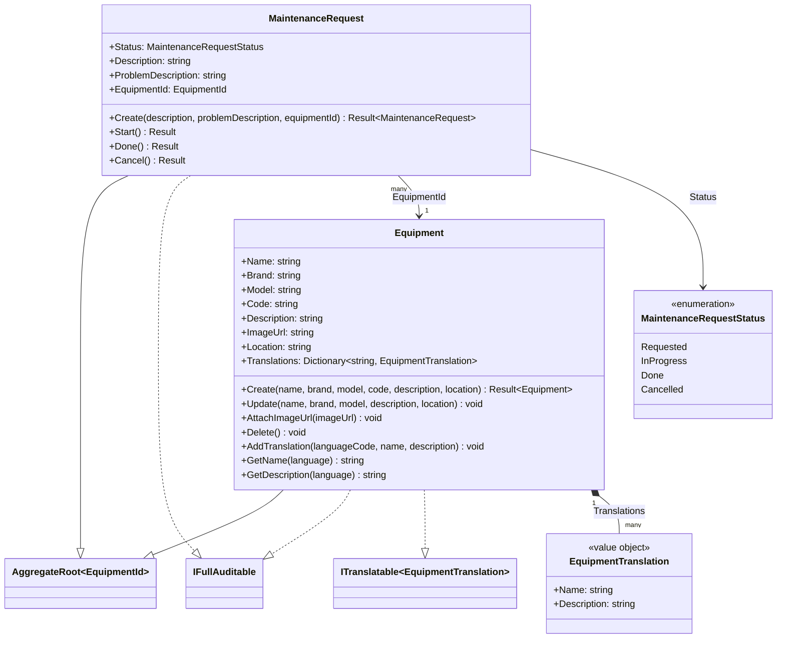

# Class Diagram — Assets Module

**English** · [Português](./class-diagram.pt-BR.md)

This document presents the domain class diagram specific to the **Assets** module. It covers exclusively the Domain layer: the `Equipment` and `MaintenanceRequest` aggregate roots, the `EquipmentTranslation` value object and the `MaintenanceRequestStatus` enum.

