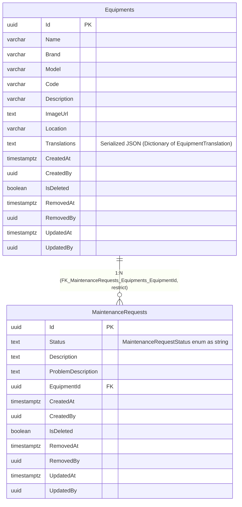

# Entity-Relationship Diagram — `assets` Schema

**English** · [Português](./er-diagram.pt-BR.md)

This document presents the `assets` schema block. It models the persistence layer (real physical tables) of the `Equipment` and `MaintenanceRequest` aggregates.

DbContext: `AssetsDbContext`. Both tables are `AggregateRoot` + `IFullAuditable`
(full creation, modification and soft delete tracking).

> Note: `MaintenanceRequest.EquipmentId` now has a real database FK constraint —
> `FK_MaintenanceRequests_Equipments_EquipmentId` (`ON DELETE RESTRICT`), added via a migration
> (not yet applied to any environment). It used to be a plain required
> `uuid` column with no `HasOne`/`HasForeignKey` in `MaintenanceRequestConfiguration`
> nor a constraint in the `Assets_InitialSetup` migration.
