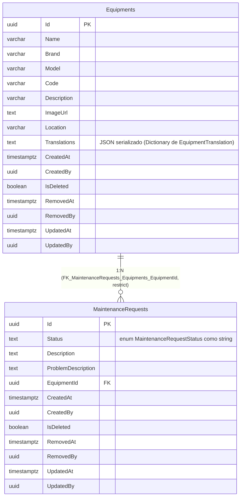

# Diagrama Entidade-Relacionamento — Schema `assets`

[English](./er-diagram.md) · **Português**

Este documento apresenta o bloco do schema `assets`. Modela a camada de persistência (tabelas físicas reais) dos agregados `Equipment` e `MaintenanceRequest`.

DbContext: `AssetsDbContext`. Ambas as tabelas são `AggregateRoot` + `IFullAuditable`
(criação, modificação e soft delete completos).

> Nota: `MaintenanceRequest.EquipmentId` agora tem constraint de FK real de banco —
> `FK_MaintenanceRequests_Equipments_EquipmentId` (`ON DELETE RESTRICT`), via migration
> (ainda não aplicada em nenhum ambiente). Antes era coluna `uuid`
> simples obrigatória sem `HasOne`/`HasForeignKey` na `MaintenanceRequestConfiguration`
> nem constraint na migration `Assets_InitialSetup`.
