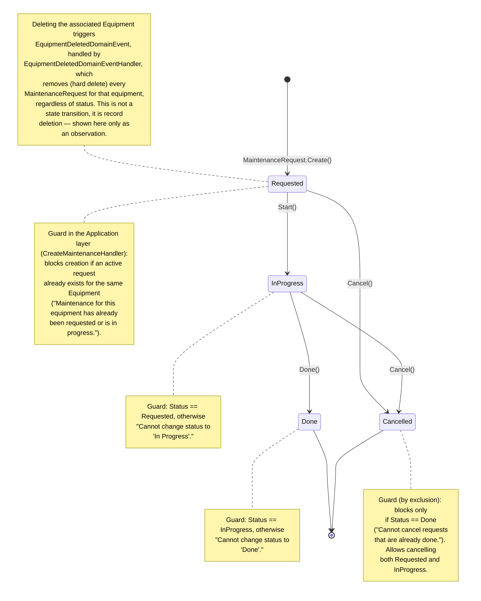

# State Diagram — MaintenanceRequest (Assets Module)

**English** · [Português](./state-diagram.pt-BR.md)

This document presents the state diagram of the `MaintenanceRequest` aggregate.

Sources: `src/Modules/Assets/Domain/MaintenanceRequests/MaintenanceRequest.cs`, `src/Modules/Assets/Domain/MaintenanceRequests/MaintenanceRequestStatus.cs`, handlers in `src/Modules/Assets/Application/MaintenanceRequests/Commands/{Create,Start,Done,Cancel}/`, `src/Modules/Assets/Application/Equipments/EventHandlers/EquipmentDeletedDomainEventHandler.cs`.

`MaintenanceRequestStatus` has 4 states: `Requested`, `InProgress`, `Done`, `Cancelled`. `Done` and `Cancelled` are terminal states.

**Reading guide**: every maintenance request is created as `Requested` (blocked at creation if another active request already exists for the same equipment) and follows the linear flow `Requested → InProgress → Done`. Cancellation (`Cancel()`) is allowed at any point before completion (`Requested` or `InProgress`), but never after (`Done` is terminal and protected). Deleting the associated `Equipment` is not a state transition — it is a direct record removal performed by `EquipmentDeletedDomainEventHandler`, outside the aggregate's status control.
