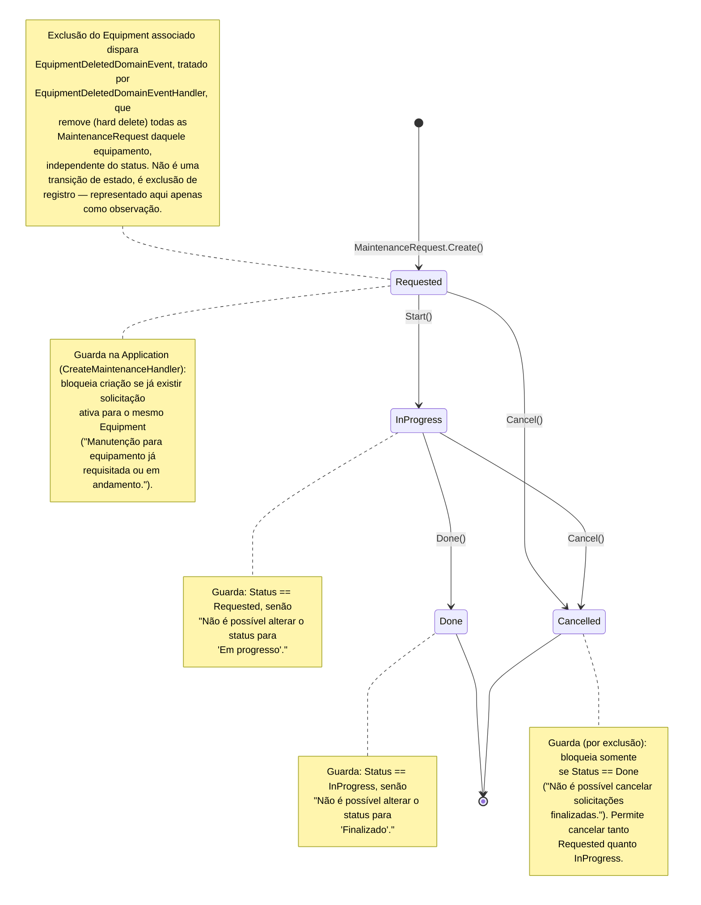

# Diagrama de Estado — MaintenanceRequest (Módulo Assets)

[English](./state-diagram.md) · **Português**

Este documento apresenta o diagrama de estado do agregado `MaintenanceRequest`.

Fontes: `src/Modules/Assets/Domain/MaintenanceRequests/MaintenanceRequest.cs`, `src/Modules/Assets/Domain/MaintenanceRequests/MaintenanceRequestStatus.cs`, Handlers em `src/Modules/Assets/Application/MaintenanceRequests/Commands/{Create,Start,Done,Cancel}/`, `src/Modules/Assets/Application/Equipments/EventHandlers/EquipmentDeletedDomainEventHandler.cs`.

`MaintenanceRequestStatus` tem 4 estados: `Requested`, `InProgress`, `Done`, `Cancelled`. `Done` e `Cancelled` são estados terminais.

**Guia de leitura**: toda solicitação de manutenção nasce `Requested` (bloqueada na criação se já houver outra ativa para o mesmo equipamento) e segue o fluxo linear `Requested → InProgress → Done`. O cancelamento (`Cancel()`) é permitido em qualquer ponto antes da conclusão (`Requested` ou `InProgress`), mas nunca depois (`Done` é terminal e protegido). A exclusão do `Equipment` associado não é uma transição de estado — é uma remoção direta do registro pelo `EquipmentDeletedDomainEventHandler`, fora do controle de status do agregado.
