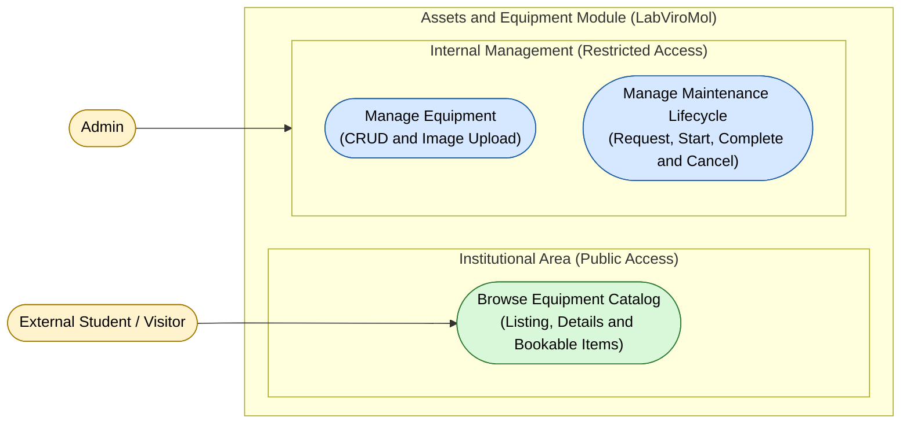

# Use Case Diagram — Assets Module

**English** · [Português](./use-case-diagram.pt-BR.md)

This document presents the use case diagram specific to the **Assets** module. It covers equipment and maintenance management, grouped into 2 internal capabilities
(equipment management and maintenance lifecycle) plus the public equipment catalog
lookup consumed by the institutional site. The actors interacting with this module
are **Admin** and **External Student / Visitor**.

**Cross-module relations:**
- `Manage Equipment` depends on `Identity.Log In / Log Out` (authentication) —
 see the Context Map (`context-map.md`) for the integration mechanism.
