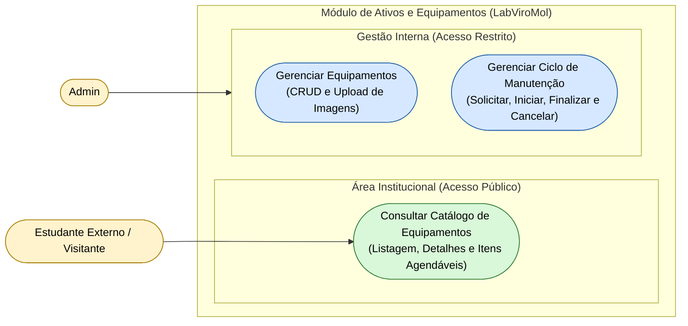

# Diagrama de Casos de Uso — Módulo Assets

[English](./use-case-diagram.md) · **Português**

Este documento apresenta o diagrama de casos de uso específico do módulo **Assets**. Cobre a gestão de equipamentos e manutenção, agrupada em 2 capacidades internas
(gestão de equipamentos e ciclo de manutenção) mais a consulta pública ao catálogo de
equipamentos consumida pelo site institucional. Interagem com este módulo os atores
**Admin** e **Estudante Externo / Visitante**.

**Relações cross-módulo:**
- `Gerenciar Equipamentos` depende de `Identity.Realizar Login / Logout` (autenticação) —
 ver Mapa de Contexto (`context-map.md`) para o mecanismo de integração.
