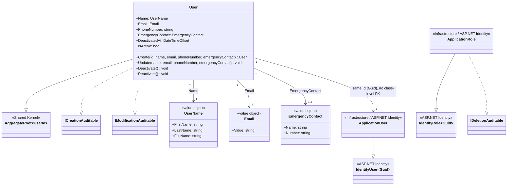

# Class Diagram — Identity Module

**English** · [Português](./class-diagram.pt-BR.md)

This document extracts the section specific to the **Identity** module, covering exclusively the Domain layer: the `User` aggregate root and its value
objects (`UserName`, `Email`, `EmergencyContact`). It also includes `ApplicationUser` and
`ApplicationRole` (`src/Modules/Identity/Infrastructure/Identity`), a documented exception
since they are special ASP.NET Identity infrastructure cases closely tied to the
`User` aggregate — without them the "domain user vs. authentication user"
duality would be invisible in the diagram.

