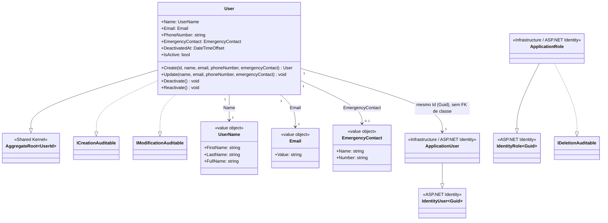

# Diagrama de Classes — Módulo Identity

[English](./class-diagram.md) · **Português**

Este documento extrai a seção específica do módulo **Identity**, cobrindo exclusivamente a camada Domain: o aggregate root `User` e seus value
objects (`UserName`, `Email`, `EmergencyContact`). Inclui também `ApplicationUser` e
`ApplicationRole` (`src/Modules/Identity/Infrastructure/Identity`), exceção documentada
por serem casos especiais de infraestrutura do ASP.NET Identity intimamente ligados ao
agregado `User` — sem elas a dualidade "usuário de domínio vs. usuário de autenticação"
ficaria invisível no diagrama.

