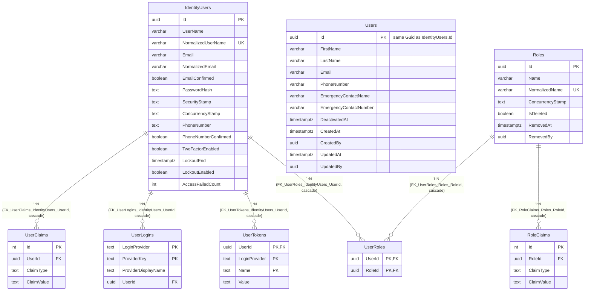

# Entity-Relationship Diagram — `identity` Schema

**English** · [Português](./er-diagram.pt-BR.md)

This document extracts the **`identity`** schema block. It models the
real persistence layer (not the domain aggregates): physical tables, columns,
types, primary/foreign keys and cardinality, extracted directly from the
`*Configuration.cs` files and confirmed against the module's latest migrations.

DbContext: `LabViroMolIdentityDbContext` (`IdentityDbContext<ApplicationUser, ApplicationRole, Guid>`).
This schema hosts both the ASP.NET Core Identity framework (`IdentityUsers`, `Roles`,
`UserRoles`, `UserClaims`, `UserLogins`, `UserTokens`, `RoleClaims`) and the app's own
domain aggregate `Users`, linked 1:1 by the same `Guid` Id (no database FK between them
— it is the same primary key value intentionally shared, not a reference).

> Note: `Users.Id` and `IdentityUsers.Id` share the same `Guid` value by
> application convention (created together during registration) — there is no database FK
> between the two tables, hence no ER line between them. `Users` has no soft
> delete (the `User` domain entity implements only `ICreationAuditable`/`IModificationAuditable`,
> not `IDeletionAuditable`) — deactivating a user uses `DeactivatedAt`, not `IsDeleted`.
