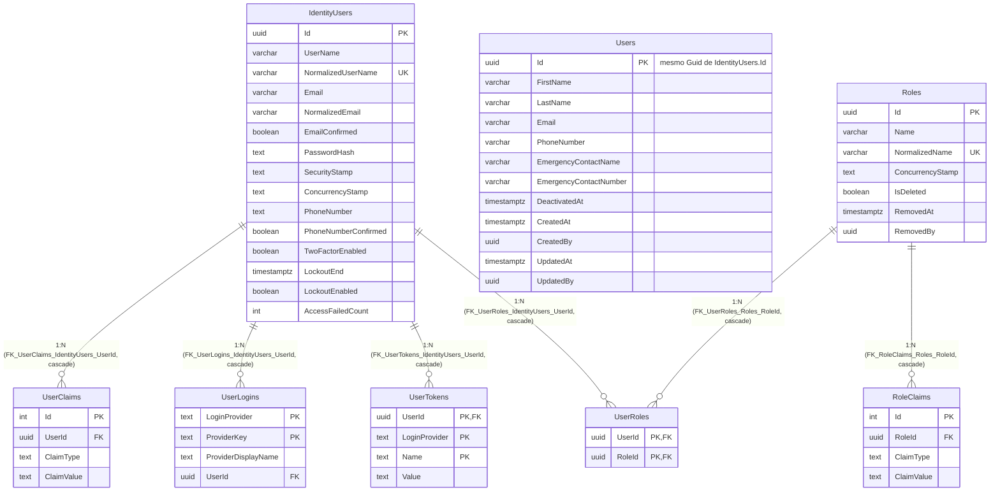

# Diagrama Entidade-Relacionamento — Schema `identity`

[English](./er-diagram.md) · **Português**

Este documento extrai o bloco do schema **`identity`**. Modela a
camada de persistência real (não os agregados de domínio): tabelas físicas, colunas,
tipos, chaves primárias/estrangeiras e cardinalidade, extraídos diretamente dos arquivos
`*Configuration.cs` e confirmados contra as migrations mais recentes do módulo.

DbContext: `LabViroMolIdentityDbContext` (`IdentityDbContext<ApplicationUser, ApplicationRole, Guid>`).
Convive nesta migração o framework ASP.NET Core Identity (`IdentityUsers`, `Roles`,
`UserRoles`, `UserClaims`, `UserLogins`, `UserTokens`, `RoleClaims`) e o agregado de
domínio próprio `Users`, ligados 1:1 pelo mesmo `Guid` de Id (sem FK de banco entre eles
— é o mesmo valor de chave primária compartilhado intencionalmente, não uma referência).

> Nota: `Users.Id` e `IdentityUsers.Id` compartilham o mesmo valor de `Guid` por
> convenção de aplicação (criados juntos no fluxo de registro) — não há FK de banco
> entre as duas tabelas, por isso não há linha ER entre elas. `Users` não tem soft
> delete (`User` no domínio implementa apenas `ICreationAuditable`/`IModificationAuditable`,
> não `IDeletionAuditable`) — desativação de usuário usa `DeactivatedAt`, não `IsDeleted`.
