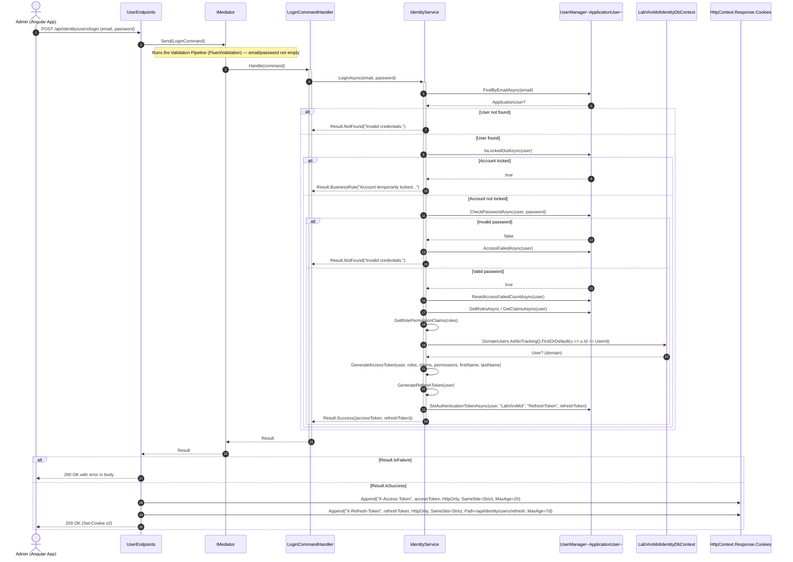
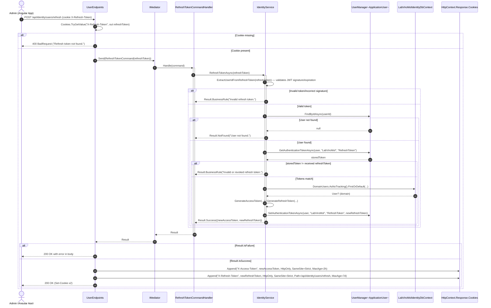

# Sequence Diagrams — Identity Module

**English** · [Português](./sequence-diagrams.pt-BR.md)

This document gathers the 2 sequence diagrams of the **Identity** module: **Login** and **Refresh Token**.
Both follow the same conventions (`autonumber`, solid/dashed
arrows for calls/returns, `alt`/`else` blocks for conditional business rules,
`Note over` used only for module boundaries and business rules that
manifest as flow branching).

---

## 1. Login

Sources: `src/Modules/Identity/Presentation/Users/UserEndpoints.cs`, `src/Modules/Identity/Application/Users/Login/{LoginCommand,LoginCommandHandler,LoginCommandValidator}.cs`, `src/Modules/Identity/Application/Users/Abstractions/IIdentityService.cs`, `src/Modules/Identity/Infrastructure/Services/IdentityService.cs`, `src/Modules/Identity/Infrastructure/Identity/ApplicationUser.cs`.

**Highlighted business rule:** `LoginCommandHandler` never interacts directly with the `User` domain aggregate — all authentication logic is delegated to `IdentityService`, which operates primarily on `ApplicationUser` (ASP.NET Identity) and only queries `_dbContext.DomainUsers` directly (bypassing the repository) to enrich the token with first/last name (a direct read of the `User` domain aggregate, outside the repository pattern, precisely because it is only for this one-off enrichment). The error response is always `200 OK` with the error in the body (there is no mapping to an error HTTP status on this endpoint).

---

## 2. Refresh Token

Sources: `src/Modules/Identity/Presentation/Users/UserEndpoints.cs`, `src/Modules/Identity/Application/Users/RefreshToken/{RefreshTokenCommand,RefreshTokenCommandHandler}.cs`, `src/Modules/Identity/Application/Users/Abstractions/IIdentityService.cs`, `src/Modules/Identity/Infrastructure/Services/IdentityService.cs`.

**Highlighted business rule:** `RefreshTokenAsync` requires both a valid JWT signature (`ExtractUserIdFromRefreshToken`) and that the received token exactly matches the token stored in the Identity store (`GetAuthenticationTokenAsync`) — this double check is what enables revocation: a logout that clears the stored token immediately invalidates any refresh token JWT still valid in the client's possession. `RefreshTokenCommandHandler` is a class distinct from `LoginCommandHandler`, but it delegates to the same `IdentityService` and follows the same HttpOnly-cookie response structure.
