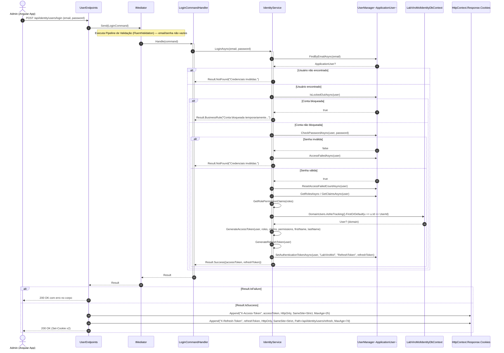
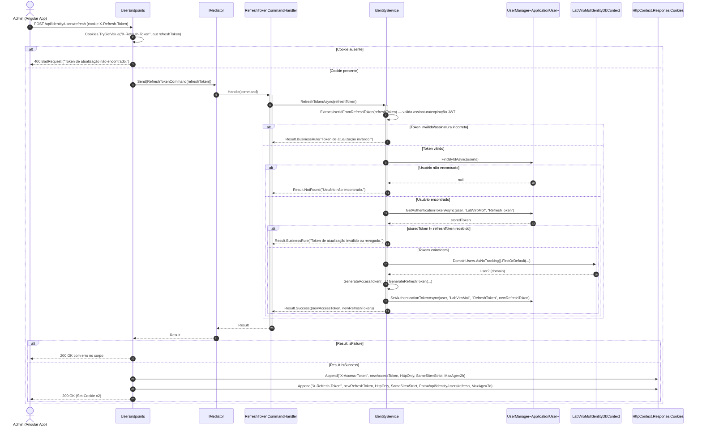

# Diagramas de Sequência — Módulo Identity

[English](./sequence-diagrams.md) · **Português**

Este documento reúne os 2 diagramas de sequência do módulo **Identity**: **Login** e **Refresh Token**.
Ambos seguem as mesmas convenções (`autonumber`, setas
sólidas/tracejadas para chamadas/retornos, blocos `alt`/`else` para regras de negócio
condicionais, `Note over` apenas para fronteiras de módulo e regras de negócio que se
manifestam como ramificação de fluxo).

---

## 1. Login

Fontes: `src/Modules/Identity/Presentation/Users/UserEndpoints.cs`, `src/Modules/Identity/Application/Users/Login/{LoginCommand,LoginCommandHandler,LoginCommandValidator}.cs`, `src/Modules/Identity/Application/Users/Abstractions/IIdentityService.cs`, `src/Modules/Identity/Infrastructure/Services/IdentityService.cs`, `src/Modules/Identity/Infrastructure/Identity/ApplicationUser.cs`.

**Regra de negócio em destaque:** o `LoginCommandHandler` nunca interage diretamente com o agregado de domínio `User` — toda a lógica de autenticação é delegada ao `IdentityService`, que opera primariamente sobre `ApplicationUser` (ASP.NET Identity) e só consulta `_dbContext.DomainUsers` diretamente (sem repository) para enriquecer o token com nome/sobrenome (leitura direta do agregado de domínio `User`, fora do padrão de repository, justamente porque é só para esse enriquecimento pontual). A resposta de erro é sempre `200 OK` com o erro no corpo (não há mapeamento para status HTTP de erro nesse endpoint).

---

## 2. Refresh Token

Fontes: `src/Modules/Identity/Presentation/Users/UserEndpoints.cs`, `src/Modules/Identity/Application/Users/RefreshToken/{RefreshTokenCommand,RefreshTokenCommandHandler}.cs`, `src/Modules/Identity/Application/Users/Abstractions/IIdentityService.cs`, `src/Modules/Identity/Infrastructure/Services/IdentityService.cs`.

**Regra de negócio em destaque:** o `RefreshTokenAsync` exige tanto uma assinatura JWT válida (`ExtractUserIdFromRefreshToken`) quanto que o token recebido coincida exatamente com o token armazenado no Identity store (`GetAuthenticationTokenAsync`) — essa dupla checagem é o que permite revogação: um logout que limpe o token armazenado invalida imediatamente qualquer refresh token JWT ainda válido em posse do cliente. O `RefreshTokenCommandHandler` é uma classe distinta do `LoginCommandHandler`, mas delega à mesma `IdentityService` e segue a mesma estrutura de resposta via cookies HttpOnly.
