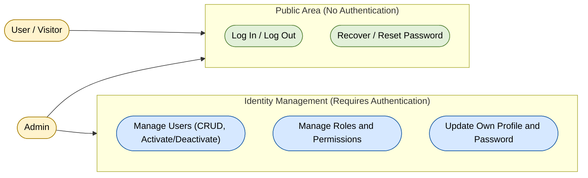

# Use Case Diagram — Identity Module

**English** · [Português](./use-case-diagram.pt-BR.md)

This document extracts the section specific to the **Identity** module. It covers authentication and user/profile/
permission management use cases, grouped into 5 high-level capabilities: public authentication (login/logout),
password recovery/reset, user management (CRUD, activate/deactivate), role and permission
management, and self-account updates. The actors interacting with this module are
**Admin** (full Identity management) and **User / Visitor** (access to the public
authentication area).

**Cross-module relations originating in other modules that depend on Identity** (not
drawn here since they belong to their source diagram, listed for reference):
`Inventory.Manage Catalog and Kits`, `Assets.Manage Equipment`,
`Research.Administer Projects` and `Scheduling.Analyze Request Queue` depend on
authentication (`Identity.Log In / Log Out`) — see the notes in those modules'
sections.
