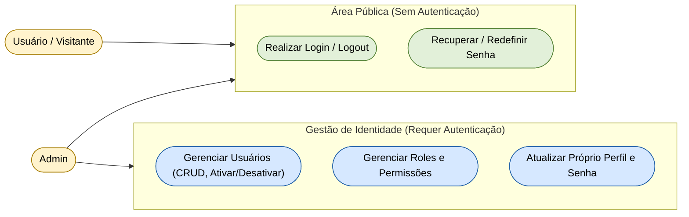

# Diagrama de Casos de Uso — Módulo Identity

[English](./use-case-diagram.md) · **Português**

Este documento extrai a seção específica do módulo **Identity**. Cobre os casos de uso de autenticação e gestão de usuários/perfis/
permissões, agrupados em 5 capacidades de alto nível: autenticação pública (login/logout),
recuperação/redefinição de senha, gestão de usuários (CRUD, ativar/desativar), gestão de
roles e permissões, e atualização da própria conta. Interagem com este módulo os atores
**Admin** (gestão completa de Identity) e **Usuário / Visitante** (acesso à área pública
de autenticação).

**Relações cross-módulo originadas em outros módulos que dependem de Identity** (não
desenhadas aqui por pertencerem ao diagrama de origem, listadas para referência):
`Inventory.Gerenciar Catálogo e Kits`, `Assets.Gerenciar Equipamentos`,
`Research.Administrar Projetos` e `Scheduling.Analisar Fila de Solicitações` dependem da
autenticação (`Identity.Realizar Login / Logout`) — ver as notas nas seções desses
módulos.
