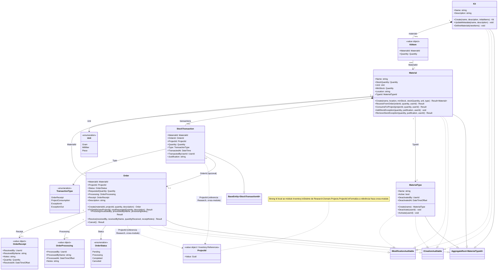

# Diagrama de Classes — Módulo Inventory

[English](./class-diagram.md) · **Português**

Este documento extrai a seção específica do módulo **Inventory**, cobrindo exclusivamente a camada Domain: os aggregate roots `MaterialType`,
`Material`, `Kit` e `Order`, a entidade filha `StockTransaction`, os value objects
(`KitItem`, `OrderProcessing`, `OrderReceipt`, `ProjectId`) e os enums (`TransactionType`,
`Unit`, `OrderStatus`).

