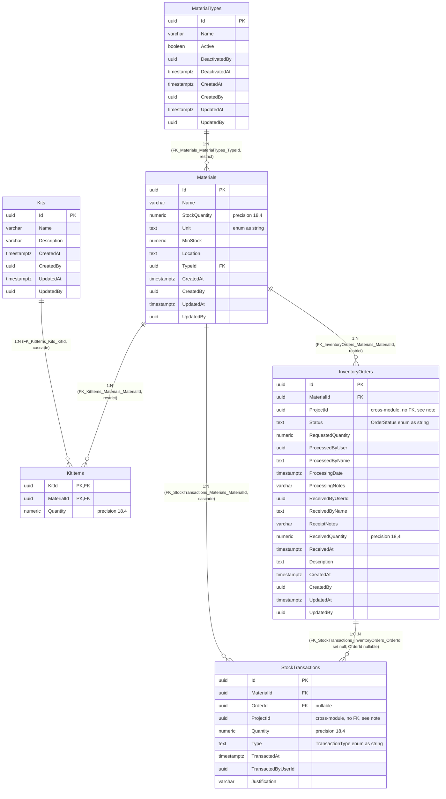

# Entity-Relationship Diagram — `inventory` Schema

**English** · [Português](./er-diagram.pt-BR.md)

This document extracts the **`inventory`** schema block. It models the
real persistence layer (not the domain aggregates): physical tables, columns,
types, primary/foreign keys and cardinality, extracted directly from the
`*Configuration.cs` files and confirmed against the module's latest migrations.

DbContext: `InventoryDbContext`. The `Order` table is persisted as `InventoryOrders`
(a physical name different from the C# entity name, confirmed via `ToTable("InventoryOrders")`
and the migration). `StockTransaction` is a `BaseEntity`, not an `AggregateRoot` — so it has no
audit column nor `xmin`.

> Note: `InventoryOrders.MaterialId`, `StockTransactions.OrderId` and `KitItems.MaterialId`
> now have real database FK constraints (migration
> `20260618043244_RenameOrderProcessedByNameColumn` and corresponding ones,
> not yet applied to any environment): `FK_InventoryOrders_Materials_MaterialId`
> (`ON DELETE RESTRICT`), `FK_KitItems_Materials_MaterialId` (`ON DELETE RESTRICT`) and
> `FK_StockTransactions_InventoryOrders_OrderId` (`ON DELETE SET NULL`, `OrderId` column
> nullable). They used to be plain columns with no `HasOne`/`HasForeignKey` declared in the
> configurations.

> Note: `InventoryOrders.ProcessedByName` was renamed (it used to be `Processing_ProcessedByName`)
> to eliminate a naming inconsistency — the `Processing_` prefix came from the Owned
> Type and was the only column in the table with that pattern, diverging from `ReceivedByName` on
> the same record (which never had a prefix). `OrderConfiguration.cs` has already been updated to
> reflect the new name. The migration `20260618043244_RenameOrderProcessedByNameColumn` still
> **needs to be applied in production** as part of the deploy — this diagram already reflects the
> post-migration target state, not the current production state.
