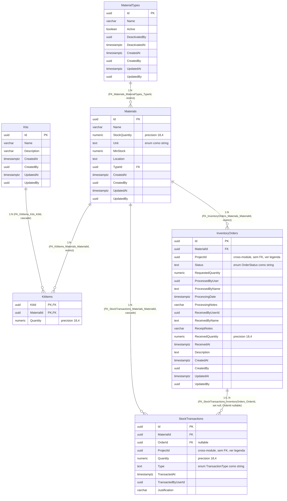

# Diagrama Entidade-Relacionamento — Schema `inventory`

[English](./er-diagram.md) · **Português**

Este documento extrai o bloco do schema **`inventory`**. Modela a
camada de persistência real (não os agregados de domínio): tabelas físicas, colunas,
tipos, chaves primárias/estrangeiras e cardinalidade, extraídos diretamente dos arquivos
`*Configuration.cs` e confirmados contra as migrations mais recentes do módulo.

DbContext: `InventoryDbContext`. Tabela `Order` é persistida como `InventoryOrders`
(nome físico diferente do nome da entidade C#, confirmado via `ToTable("InventoryOrders")`
e migration). `StockTransaction` é `BaseEntity`, não `AggregateRoot` — por isso não tem
coluna de auditoria nem `xmin`.

> Nota: `InventoryOrders.MaterialId`, `StockTransactions.OrderId` e `KitItems.MaterialId`
> agora têm constraint de FK real de banco (migration
> `20260618043244_RenameOrderProcessedByNameColumn` e correspondentes,
> ainda não aplicadas em nenhum ambiente): `FK_InventoryOrders_Materials_MaterialId`
> (`ON DELETE RESTRICT`), `FK_KitItems_Materials_MaterialId` (`ON DELETE RESTRICT`) e
> `FK_StockTransactions_InventoryOrders_OrderId` (`ON DELETE SET NULL`, coluna `OrderId`
> nullable). Antes eram colunas simples sem `HasOne`/`HasForeignKey` declarado nas
> configurations.

> Nota: `InventoryOrders.ProcessedByName` foi renomeada (era `Processing_ProcessedByName`)
> para eliminar uma inconsistência de nomenclatura — o prefixo `Processing_` vinha do Owned
> Type e era a única coluna da tabela com esse padrão, divergindo de `ReceivedByName` no
> mesmo registro (que nunca teve prefixo). `OrderConfiguration.cs` já foi atualizado para
> refletir o novo nome. A migration `20260618043244_RenameOrderProcessedByNameColumn` ainda
> **precisa ser aplicada em produção** como parte do deploy — este diagrama já reflete o
> estado-alvo pós-migration, não o estado atual de produção.
