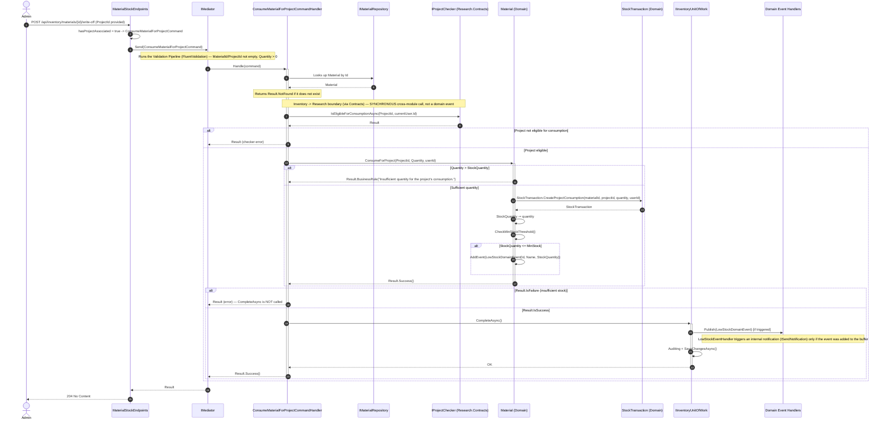
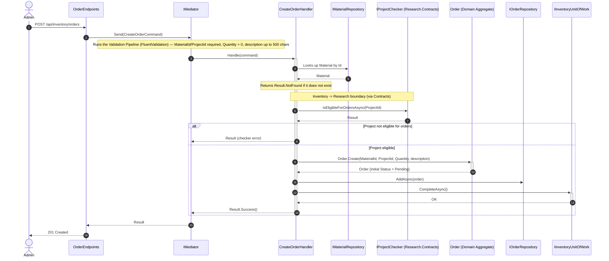
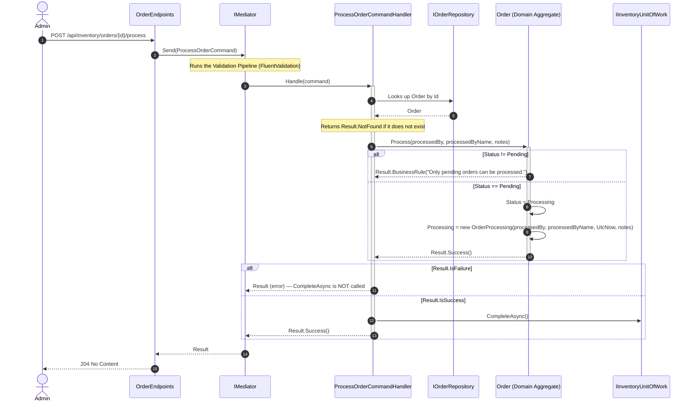
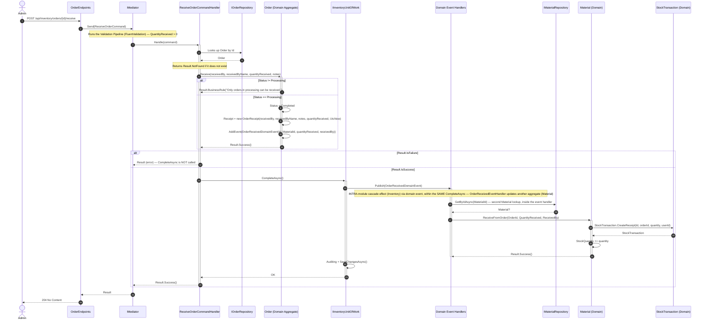
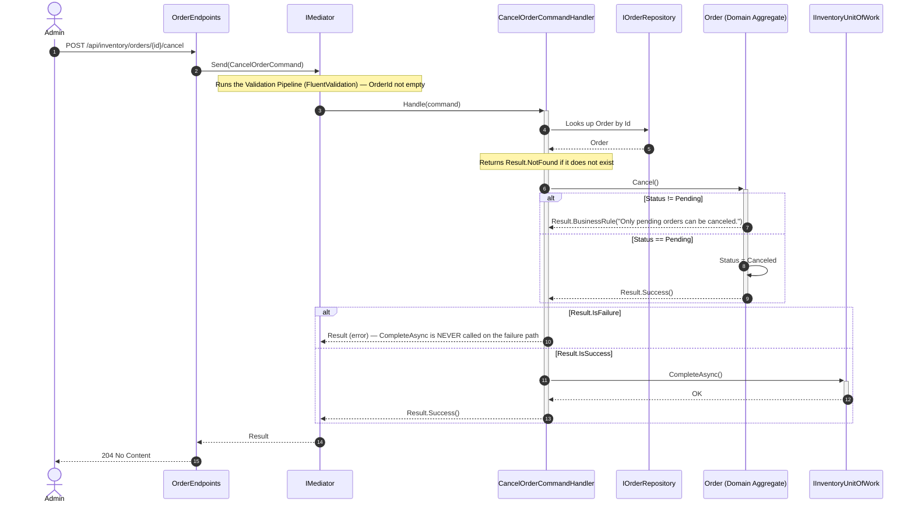
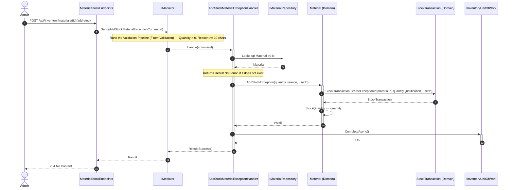
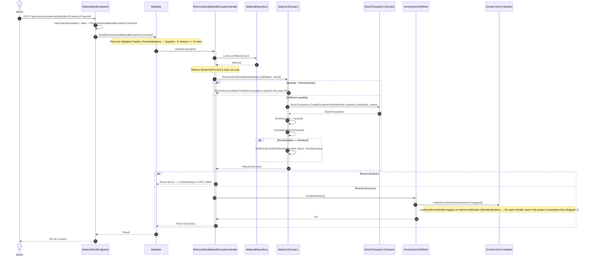

# Sequence Diagrams — Inventory Module

**English** · [Português](./sequence-diagrams.pt-BR.md)

This document gathers the 7 sequence diagrams of the **Inventory** module: **Consume Material for
Project**, **Create Purchase Order**, **Process Order**, **Receive Order**,
**Cancel Order**, **Add Stock by Exception**, and **Remove Stock by
Exception**. They cover the full lifecycle of the central `Order` aggregate and the stock
movement operations of the `Material` aggregate, since these are the system's core modules.
They follow the same conventions (`autonumber`, solid/dashed
arrows for calls/returns, `alt`/`else` blocks for conditional business rules, `loop`
blocks for domain event publication in
`BaseUnitOfWork.CompleteAsync()`, `Note over` only for module boundaries and business
rules that manifest as flow branching).

---

## 1. Consume Material for Project

Sources: `src/Modules/Inventory/Presentation/Materials/MaterialStockEndpoints.cs`, `src/Modules/Inventory/Application/Materials/Commands/ConsumeForProject/{ConsumeMaterialForProjectCommand,ConsumeMaterialForProjectCommandHandler,ConsumeMaterialForProjectValidator}.cs`, `src/Modules/Research/Contracts/IProjectChecker.cs`, `src/Modules/Inventory/Domain/Materials/{Material,StockTransaction,LowStockDomainEvent}.cs`, `src/Modules/Inventory/Application/Materials/EventHandlers/LowStockEventHandler.cs`.

**Highlighted business rule:** the project eligibility check via `IProjectChecker.IsEligibleForConsumptionAsync` is a SYNCHRONOUS cross-module call (Inventory consumes a contract implemented by Research.Infrastructure via DI), unlike the asynchronous domain-event pattern used between aggregates within the same module. The firing of `LowStockDomainEvent` is conditional: it only occurs if, after consumption, `StockQuantity <= MinStock`.

---

## 2. Create Purchase Order

Sources: `src/Modules/Inventory/Presentation/Orders/OrderEndpoints.cs`, `src/Modules/Inventory/Application/Orders/Commands/Create/{CreateOrderCommand,CreateOrderHandler,CreateOrderValidator}.cs`, `src/Modules/Inventory/Domain/Orders/{Order,OrderStatus}.cs`, `src/Modules/Research/Contracts/IProjectChecker.cs`, `src/Modules/Inventory/Application/Orders/Commands/FixDetails/{FixOrderDetailsCommand,FixOrderDetailsHandler}.cs` (note).

**Highlighted business rule:** the exact validation order is: Material lookup (if it does not exist, `NotFound`) → `IsEligibleForOrdersAsync(ProjectId)` (if it fails, returns the checker's error) → `Order.Create(...)`. Unlike `Schedule.Create`, `Order.Create` does not trigger any domain event — there is no `CompleteAsync` publishing events in this flow, the pipeline goes straight to auditing + `SaveChangesAsync()`; the order's lifecycle only generates events on the `Receive` transition (see Diagram 4). *Side note:* `FixOrderDetailsCommand` (`PUT /{id}/fix-details`) follows a similar design (looks up `Order`, `IsEligibleForOrdersAsync` for the new `ProjectId`, `order.FixDetails`), but it is only allowed if `Order.Status == Pending`, otherwise it returns a `BusinessRule` for details not corrected — there is not enough logic to justify a diagram of its own.

---

## 3. Process Order

Sources: `src/Modules/Inventory/Presentation/Orders/OrderEndpoints.cs`, `src/Modules/Inventory/Application/Orders/Commands/Process/{ProcessOrderCommand,ProcessOrderCommandHandler,ProcessOrderCommandValidator}.cs`, `src/Modules/Inventory/Domain/Orders/{Order,OrderProcessing}.cs`.

**Highlighted business rule:** `Order.Process` only allows the transition when `Status == Pending`, changing it to `Processing` and recording an `OrderProcessing` (who processed it, when, notes). This transition does NOT trigger any domain event — `CompleteAsync()` here merely persists standard auditing (`CreatedAt`/`CreatedBy`) via `SaveChangesAsync()`, without publishing domain events.

---

## 4. Receive Order

Sources: `src/Modules/Inventory/Presentation/Orders/OrderEndpoints.cs`, `src/Modules/Inventory/Application/Orders/Commands/Receive/{ReceiveOrderCommand,ReceiveOrderCommandHandler,ReceiveOrderCommandValidator}.cs`, `src/Modules/Inventory/Domain/Orders/{Order,OrderReceipt,OrderReceivedDomainEvent}.cs`, `src/Modules/Inventory/Application/Materials/EventHandlers/OrderReceivedEventHandler.cs`, `src/Modules/Inventory/Domain/Materials/{Material,StockTransaction}.cs`.

**Highlighted business rule:** only `Receive` (unlike `Process`, see Diagram 3) triggers `OrderReceivedDomainEvent`, which is consumed by `OrderReceivedEventHandler` within the SAME `CompleteAsync` of the receipt phase, updating the `Material` aggregate (intra-module cascade effect via event, not a direct call). `Material.ReceiveFromOrder` NEVER calls `CheckMinStockThreshold()` — receiving an order never triggers `LowStockDomainEvent`, since it is a stock inflow; only outflows (consumption for project, write-off by exception) check the minimum threshold.

---

## 5. Cancel Order

Sources: `src/Modules/Inventory/Presentation/Orders/OrderEndpoints.cs`, `src/Modules/Inventory/Application/Orders/Commands/Cancel/{CancelOrderCommand,CancelOrderCommandHandler,CancelOrderCommandValidator}.cs`, `src/Modules/Inventory/Domain/Orders/Order.cs`.

**Highlighted business rule:** `Order.Cancel()` only allows the transition when `Status == Pending` — orders in `Processing` (already processed) or `Completed` (already received) are immutable regarding cancellation and can no longer be reverted. The transition does not trigger any domain event. On the failure path, `_unitOfWork.CompleteAsync()` is never invoked, so no changes are persisted.

---

## 6. Add Stock by Exception

Sources: `src/Modules/Inventory/Presentation/Materials/MaterialStockEndpoints.cs`, `src/Modules/Inventory/Application/Materials/Commands/AddStockException/{AddStockMaterialExceptionCommand,AddStockMaterialExceptionHandler,AddStockMaterialExceptionValidator}.cs`, `src/Modules/Inventory/Domain/Materials/{Material,StockTransaction}.cs`.

**Highlighted business rule:** `Material.AddStockException` is a `void` method — it never fails and does NOT check the minimum stock threshold, unlike `RemoveStockException` (Diagram 7), since a stock inflow never triggers `LowStockDomainEvent`. Because of this, this flow has no domain event to publish in `CompleteAsync()`, unlike the "remove" counterpart of this same exception operation.

---

## 7. Remove Stock by Exception

Sources: `src/Modules/Inventory/Presentation/Materials/MaterialStockEndpoints.cs`, `src/Modules/Inventory/Application/Materials/Commands/RemoveStockException/{RemoveStockMaterialExceptionCommand,RemoveStockMaterialExceptionHandler,RemoveStockMaterialExceptionValidator}.cs`, `src/Modules/Inventory/Domain/Materials/{Material,StockTransaction,LowStockDomainEvent}.cs`, `src/Modules/Inventory/Application/Materials/EventHandlers/LowStockEventHandler.cs`.

**Highlighted business rule:** a clear asymmetry compared to the add operation (Diagram 6) — `RemoveStockException` returns a `Result` (it can fail due to insufficient quantity) and, on success, calls `CheckMinStockThreshold()`, potentially triggering the SAME `LowStockDomainEvent` and the SAME `LowStockEventHandler` already used in the project consumption flow (Diagram 1).
