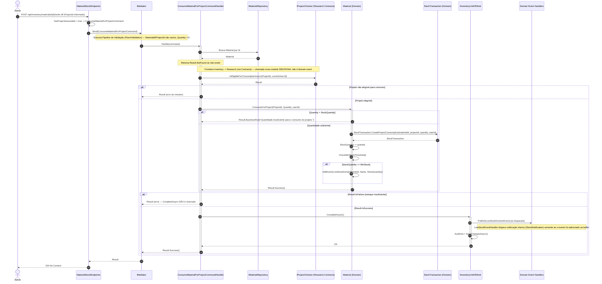
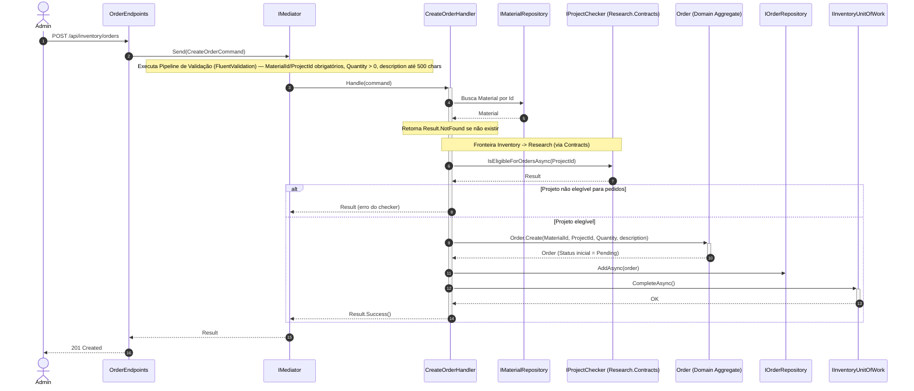
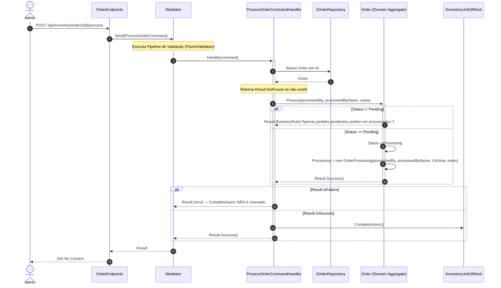
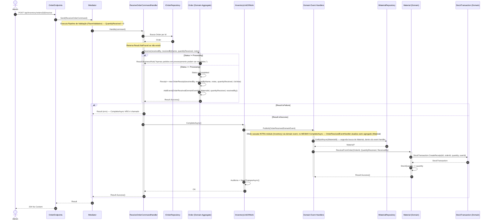
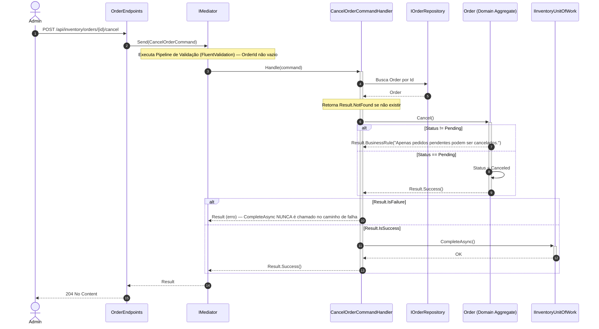
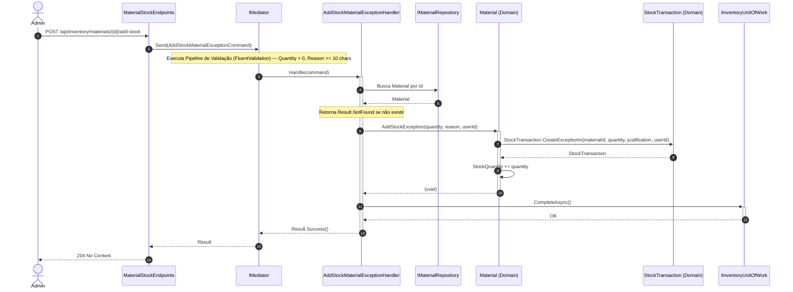
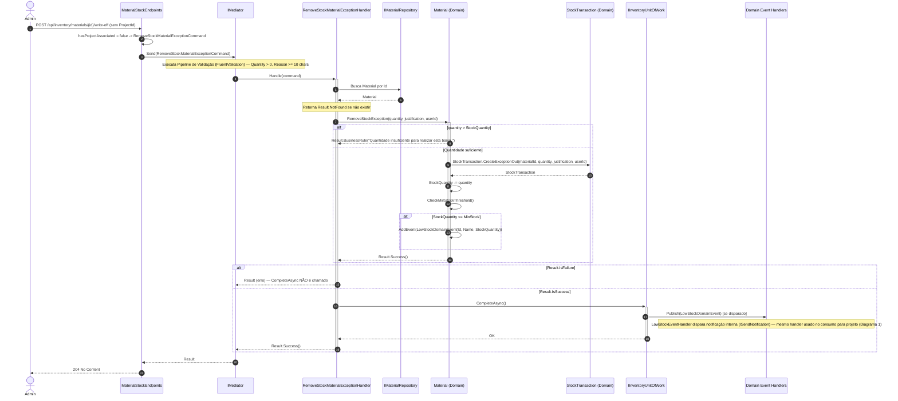

# Diagramas de Sequência — Módulo Inventory

[English](./sequence-diagrams.md) · **Português**

Este documento reúne os 7 diagramas de sequência do módulo **Inventory**: **Consumir Material para
Projeto**, **Criar Pedido de Compra**, **Processar Pedido**, **Receber Pedido**,
**Cancelar Pedido**, **Adicionar Estoque por Exceção** e **Remover Estoque por
Exceção**. Cobrem o ciclo de vida completo do agregado central `Order` e as operações de
movimentação de estoque do agregado `Material`, por serem os módulos core do sistema.
Seguem as mesmas convenções (`autonumber`, setas
sólidas/tracejadas para chamadas/retornos, blocos `alt`/`else` para regras de negócio
condicionais, blocos `loop` para publicação de domain events em
`BaseUnitOfWork.CompleteAsync()`, `Note over` apenas para fronteiras de módulo e regras de
negócio que se manifestam como ramificação de fluxo).

---

## 1. Consumir Material para Projeto

Fontes: `src/Modules/Inventory/Presentation/Materials/MaterialStockEndpoints.cs`, `src/Modules/Inventory/Application/Materials/Commands/ConsumeForProject/{ConsumeMaterialForProjectCommand,ConsumeMaterialForProjectCommandHandler,ConsumeMaterialForProjectValidator}.cs`, `src/Modules/Research/Contracts/IProjectChecker.cs`, `src/Modules/Inventory/Domain/Materials/{Material,StockTransaction,LowStockDomainEvent}.cs`, `src/Modules/Inventory/Application/Materials/EventHandlers/LowStockEventHandler.cs`.

**Regra de negócio em destaque:** a checagem de elegibilidade do projeto via `IProjectChecker.IsEligibleForConsumptionAsync` é uma chamada cross-module SÍNCRONA (Inventory consome um contrato implementado por Research.Infrastructure via DI), diferente do padrão assíncrono via domain events usado entre agregados do mesmo módulo. O disparo de `LowStockDomainEvent` é condicional: só ocorre se, após o consumo, `StockQuantity <= MinStock`.

---

## 2. Criar Pedido de Compra

Fontes: `src/Modules/Inventory/Presentation/Orders/OrderEndpoints.cs`, `src/Modules/Inventory/Application/Orders/Commands/Create/{CreateOrderCommand,CreateOrderHandler,CreateOrderValidator}.cs`, `src/Modules/Inventory/Domain/Orders/{Order,OrderStatus}.cs`, `src/Modules/Research/Contracts/IProjectChecker.cs`, `src/Modules/Inventory/Application/Orders/Commands/FixDetails/{FixOrderDetailsCommand,FixOrderDetailsHandler}.cs` (nota).

**Regra de negócio em destaque:** a ordem exata de validação é busca de `Material` (se não existir, `NotFound`) → `IsEligibleForOrdersAsync(ProjectId)` (se falha, retorna erro do checker) → `Order.Create(...)`. Diferente de `Schedule.Create`, `Order.Create` não dispara nenhum domain event — não há `CompleteAsync` publicando eventos neste fluxo, o pipeline executa direto auditoria + `SaveChangesAsync()`; o ciclo de vida do pedido só gera eventos na transição `Receive` (ver Diagrama 4). *Nota satélite:* `FixOrderDetailsCommand` (`PUT /{id}/fix-details`) segue um desenho semelhante (busca `Order`, `IsEligibleForOrdersAsync` para o novo `ProjectId`, `order.FixDetails`), mas só é permitido se `Order.Status == Pending`, senão retorna `BusinessRule` de detalhes não corrigidos — não há lógica suficiente para justificar diagrama próprio.

---

## 3. Processar Pedido

Fontes: `src/Modules/Inventory/Presentation/Orders/OrderEndpoints.cs`, `src/Modules/Inventory/Application/Orders/Commands/Process/{ProcessOrderCommand,ProcessOrderCommandHandler,ProcessOrderCommandValidator}.cs`, `src/Modules/Inventory/Domain/Orders/{Order,OrderProcessing}.cs`.

**Regra de negócio em destaque:** `Order.Process` só permite a transição quando `Status == Pending`, mudando para `Processing` e registrando `OrderProcessing` (quem processou, quando, notas). Essa transição NÃO dispara nenhum domain event — `CompleteAsync()` aqui apenas persiste a auditoria padrão (`CreatedAt`/`CreatedBy`) via `SaveChangesAsync()`, sem publicar eventos de domínio.

---

## 4. Receber Pedido

Fontes: `src/Modules/Inventory/Presentation/Orders/OrderEndpoints.cs`, `src/Modules/Inventory/Application/Orders/Commands/Receive/{ReceiveOrderCommand,ReceiveOrderCommandHandler,ReceiveOrderCommandValidator}.cs`, `src/Modules/Inventory/Domain/Orders/{Order,OrderReceipt,OrderReceivedDomainEvent}.cs`, `src/Modules/Inventory/Application/Materials/EventHandlers/OrderReceivedEventHandler.cs`, `src/Modules/Inventory/Domain/Materials/{Material,StockTransaction}.cs`.

**Regra de negócio em destaque:** só `Receive` (diferente de `Process`, ver Diagrama 3) dispara `OrderReceivedDomainEvent`, que é consumido pelo `OrderReceivedEventHandler` dentro do MESMO `CompleteAsync` da fase de recebimento, atualizando o agregado `Material` (efeito cascata intra-módulo via evento, não chamada direta). `Material.ReceiveFromOrder` NUNCA chama `CheckMinStockThreshold()` — recebimento de pedido nunca dispara `LowStockDomainEvent`, pois é entrada de estoque; somente saídas (consumo por projeto, baixa por exceção) verificam o limiar mínimo.

---

## 5. Cancelar Pedido

Fontes: `src/Modules/Inventory/Presentation/Orders/OrderEndpoints.cs`, `src/Modules/Inventory/Application/Orders/Commands/Cancel/{CancelOrderCommand,CancelOrderCommandHandler,CancelOrderCommandValidator}.cs`, `src/Modules/Inventory/Domain/Orders/Order.cs`.

**Regra de negócio em destaque:** `Order.Cancel()` só permite a transição quando `Status == Pending` — pedidos em `Processing` (já processados) ou `Completed` (já recebidos) são imutáveis quanto a cancelamento e não podem mais retroceder. A transição não dispara nenhum domain event. No caminho de falha, `_unitOfWork.CompleteAsync()` nunca é invocado, então nenhuma alteração é persistida.

---

## 6. Adicionar Estoque por Exceção

Fontes: `src/Modules/Inventory/Presentation/Materials/MaterialStockEndpoints.cs`, `src/Modules/Inventory/Application/Materials/Commands/AddStockException/{AddStockMaterialExceptionCommand,AddStockMaterialExceptionHandler,AddStockMaterialExceptionValidator}.cs`, `src/Modules/Inventory/Domain/Materials/{Material,StockTransaction}.cs`.

**Regra de negócio em destaque:** `Material.AddStockException` é um método `void` — nunca falha e NÃO verifica o limiar mínimo de estoque, ao contrário de `RemoveStockException` (Diagrama 7), pois entrada de estoque nunca dispara `LowStockDomainEvent`. Por isso este fluxo não tem nenhum domain event a publicar em `CompleteAsync()`, diferente do par "remover" desta mesma operação de exceção.

---

## 7. Remover Estoque por Exceção

Fontes: `src/Modules/Inventory/Presentation/Materials/MaterialStockEndpoints.cs`, `src/Modules/Inventory/Application/Materials/Commands/RemoveStockException/{RemoveStockMaterialExceptionCommand,RemoveStockMaterialExceptionHandler,RemoveStockMaterialExceptionValidator}.cs`, `src/Modules/Inventory/Domain/Materials/{Material,StockTransaction,LowStockDomainEvent}.cs`, `src/Modules/Inventory/Application/Materials/EventHandlers/LowStockEventHandler.cs`.

**Regra de negócio em destaque:** assimetria clara em relação à operação de adição (Diagrama 6) — `RemoveStockException` retorna `Result` (pode falhar por quantidade insuficiente) e, em caso de sucesso, chama `CheckMinStockThreshold()`, podendo disparar a MESMA `LowStockDomainEvent` e o MESMO `LowStockEventHandler` já usados no consumo para projeto (Diagrama 1).
