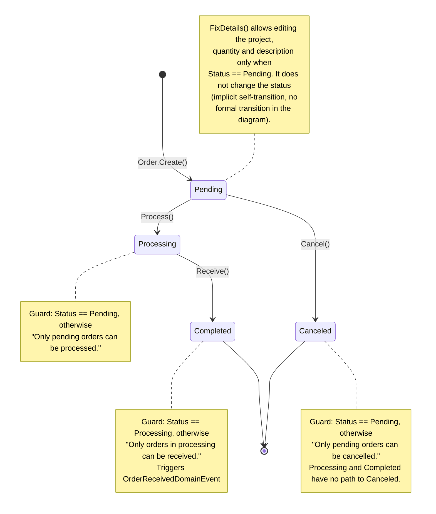

# State Diagram — Order (Inventory)

**English** · [Português](./state-diagram.pt-BR.md)

This document extracts the section specific to the `Order` aggregate. It shows the complete lifecycle of `OrderStatus`, controlled by an enum with
explicit transition rules in the domain: every state, every
valid transition, the domain method that triggers each transition and the guard(s)/precondition(s)
that block invalid transitions.

Sources: `src/Modules/Inventory/Domain/Orders/Order.cs`, `src/Modules/Inventory/Domain/Orders/OrderStatus.cs`, handlers in `src/Modules/Inventory/Application/Orders/Commands/{Process,Receive,Cancel,FixDetails}/`.

`OrderStatus` has 4 states: `Pending`, `Processing`, `Completed`, `Canceled`. `Completed` and `Canceled` are terminal states — no transition leaves them. `FixDetails(...)` is only allowed when `Status == Pending`, but it does not change the status (which is why it appears as a note rather than a formal transition).

**Reading guide**: an order is always created as `Pending`. From there it follows one of two mutually exclusive paths: advancing to `Processing` (and then to `Completed`, the success terminal state) or being `Canceled` directly (the withdrawal terminal state). Once in `Processing` or `Completed`, cancellation is no longer possible.
