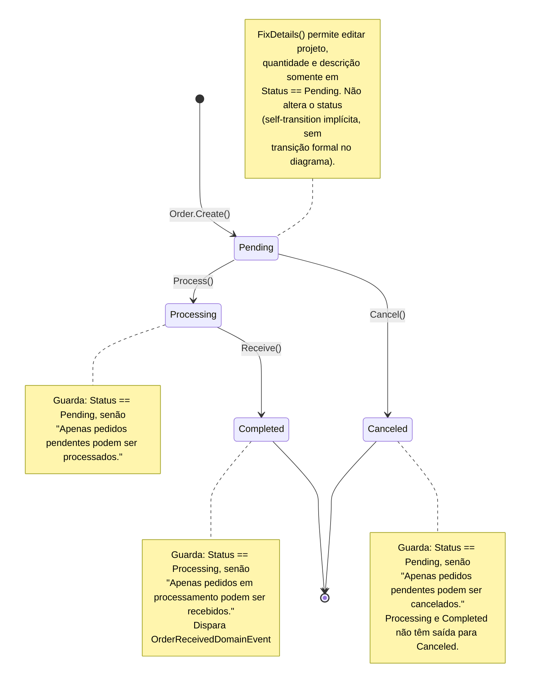

# Diagrama de Estado — Order (Inventory)

[English](./state-diagram.md) · **Português**

Este documento extrai a seção específica do agregado `Order`. Mostra o ciclo de vida completo do `OrderStatus`, controlado por um enum com
regras de transição explícitas no domínio: todos os estados, todas as transições
válidas, o método de domínio que dispara cada transição e a(s) guarda(s)/precondição(ões)
que bloqueiam transições inválidas.

Fontes: `src/Modules/Inventory/Domain/Orders/Order.cs`, `src/Modules/Inventory/Domain/Orders/OrderStatus.cs`, Handlers em `src/Modules/Inventory/Application/Orders/Commands/{Process,Receive,Cancel,FixDetails}/`.

`OrderStatus` tem 4 estados: `Pending`, `Processing`, `Completed`, `Canceled`. `Completed` e `Canceled` são estados terminais — nenhuma transição parte deles. `FixDetails(...)` é permitido apenas em `Status == Pending`, mas não altera o status (por isso aparece como nota, não como transição formal).

**Guia de leitura**: o pedido nasce sempre `Pending`. A partir daí segue dois caminhos possíveis e mutuamente exclusivos: avançar para `Processing` (e depois `Completed`, estado terminal de sucesso) ou ser `Canceled` diretamente (estado terminal de desistência). Uma vez em `Processing` ou `Completed`, o cancelamento não é mais possível.
