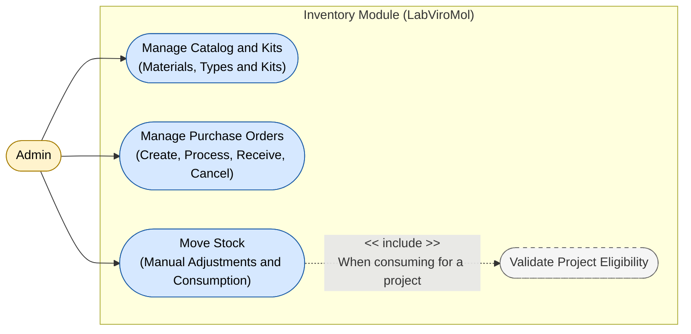

# Use Case Diagram — Inventory Module

**English** · [Português](./use-case-diagram.pt-BR.md)

This document extracts the section specific to the **Inventory** module. It covers stock management use cases, grouped into 3 operational
capabilities (catalog and kit management, purchase order management, stock
movement) plus the project eligibility validation business rule, included when
consuming material for a project. The only actor interacting with this module is **Admin**.

**Cross-module relations:**
- `Manage Catalog and Kits` depends on `Identity.Log In / Log Out` (authentication)
 — see the Context Map (`context-map.md`) for the integration mechanism.
- `Manage Purchase Orders` (upon receiving an order) triggers
 `Notify.Process Domain Events` — see the Context Map (`context-map.md`) for the
 integration mechanism.
