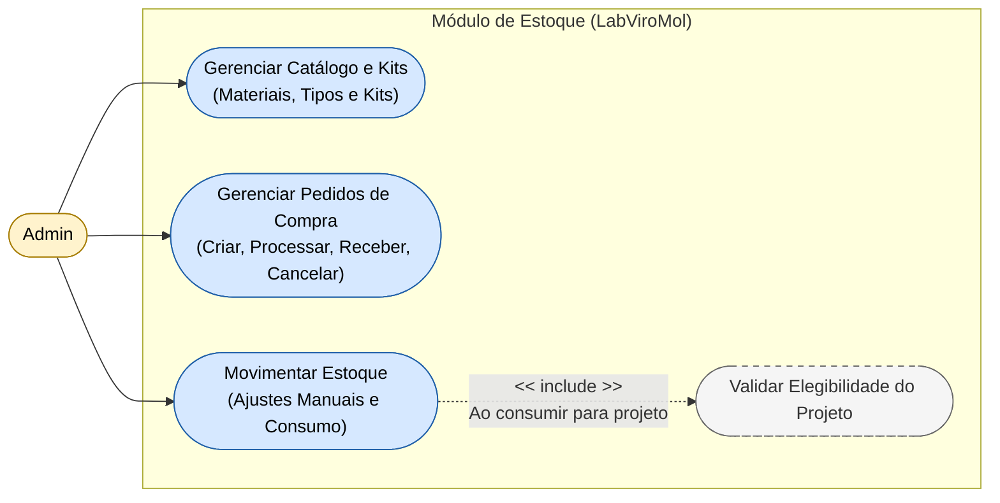

# Diagrama de Casos de Uso — Módulo Inventory

[English](./use-case-diagram.md) · **Português**

Este documento extrai a seção específica do módulo **Inventory**. Cobre os casos de uso de gestão de estoque, agrupados em 3 capacidades
operacionais (gestão de catálogo e kits, gestão de pedidos de compra, movimentação de
estoque) mais a regra de negócio de validação de elegibilidade do projeto, incluída ao
consumir material para um projeto. Interage com este módulo apenas o ator **Admin**.

**Relações cross-módulo:**
- `Gerenciar Catálogo e Kits` depende de `Identity.Realizar Login / Logout` (autenticação)
 — ver Mapa de Contexto (`context-map.md`) para o mecanismo de integração.
- `Gerenciar Pedidos de Compra` (ao receber um pedido) dispara
 `Notify.Processar Eventos de Domínio` — ver Mapa de Contexto (`context-map.md`) para o
 mecanismo de integração.
