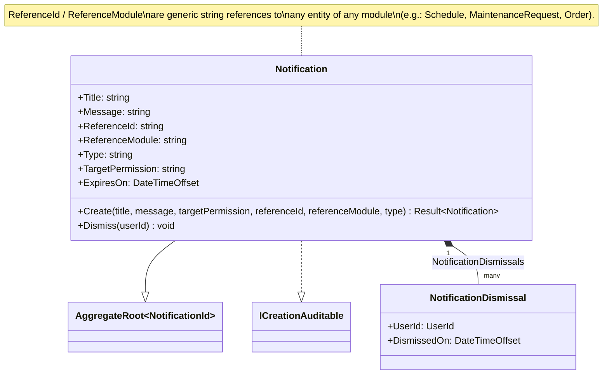

# Class Diagram — Notify Module

**English** · [Português](./class-diagram.pt-BR.md)

This document presents the domain class diagram of the **Notify** module. It covers
the `Notification` aggregate root and its child entity `NotificationDismissal`.

