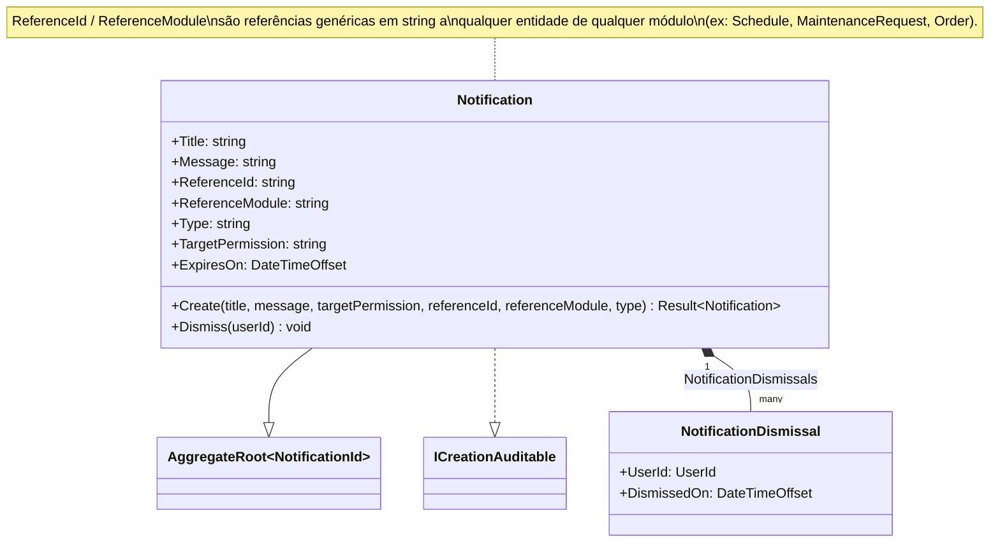

# Diagrama de Classes — Módulo Notify

[English](./class-diagram.md) · **Português**

Este documento apresenta o diagrama de classes do domínio do módulo **Notify**. Cobre
o aggregate root `Notification` e sua entidade filha `NotificationDismissal`.

