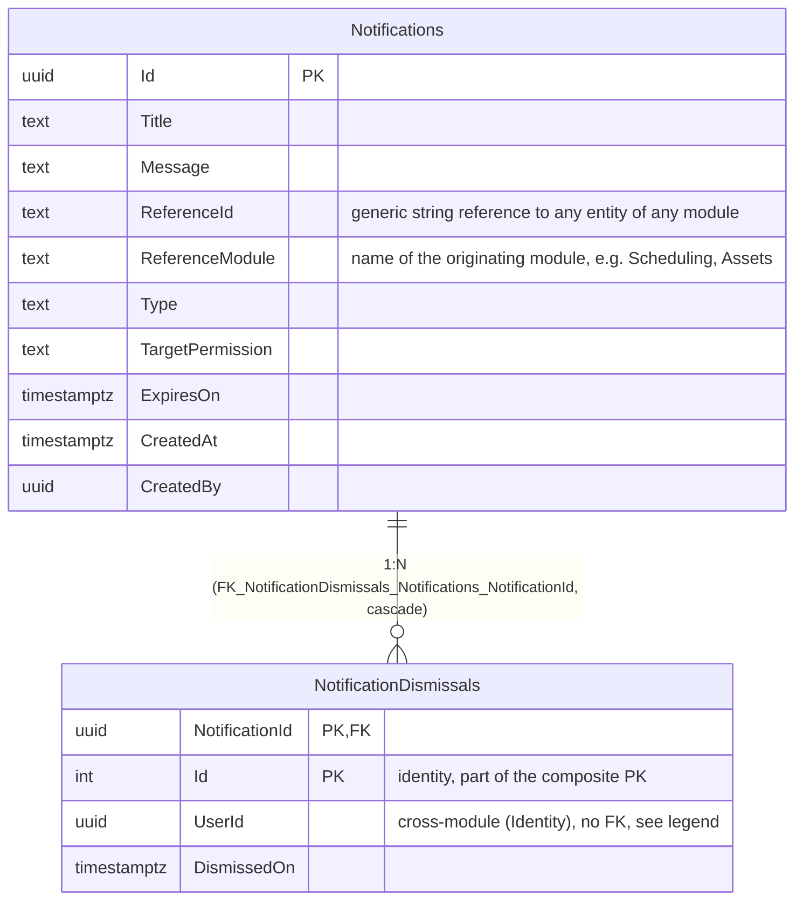

# Entity-Relationship Diagram — Notify Module

**English** · [Português](./er-diagram.pt-BR.md)

This document presents the ER block for the `notify` schema. DbContext:
`NotifyDbContext`. `Notification` implements only `ICreationAuditable` (no
modification or soft delete).

> Note: `Notifications` has no `UpdatedAt`/`UpdatedBy` nor soft delete (`Notification`
> implements only `ICreationAuditable`). `NotificationDismissals.UserId` references
> `identity.Users`/`IdentityUsers` without a database FK (cross-module).
