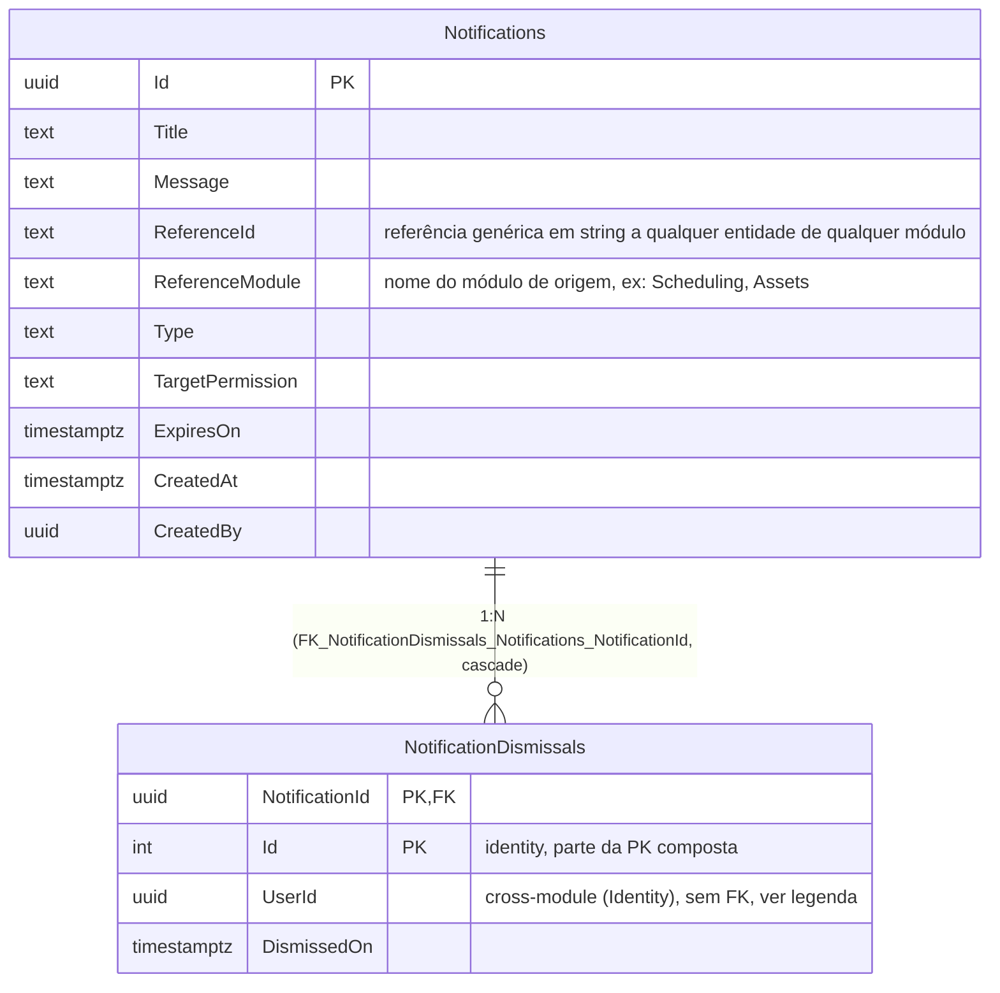

# Diagrama Entidade-Relacionamento — Módulo Notify

[English](./er-diagram.md) · **Português**

Este documento apresenta o bloco ER do schema `notify`. DbContext:
`NotifyDbContext`. `Notification` implementa apenas `ICreationAuditable` (sem
modificação nem soft delete).

> Nota: `Notifications` não tem `UpdatedAt`/`UpdatedBy` nem soft delete (`Notification`
> implementa só `ICreationAuditable`). `NotificationDismissals.UserId` referencia
> `identity.Users`/`IdentityUsers` sem FK de banco (cross-module).
