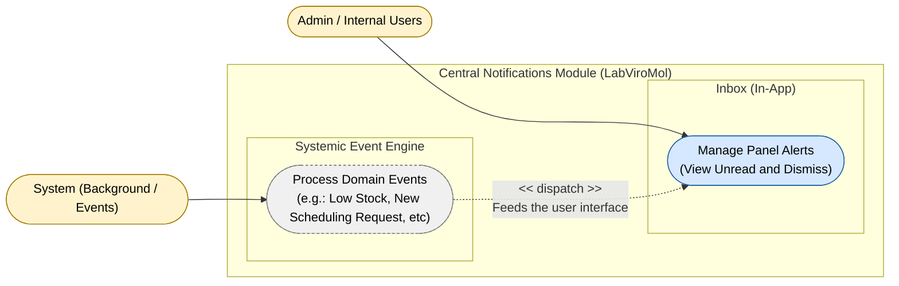

# Use Case Diagram — Notify Module

**English** · [Português](./use-case-diagram.pt-BR.md)

This document presents the use case diagram of the **Notify** module. It covers
internal notifications, grouped into 2 capabilities: the in-app inbox consumed
by the Admin (view unread and dismiss) and the systemic event engine that processes
Domain Events from other modules and feeds this inbox. The actors **Admin** and
**System** interact with this module.

**Cross-module relations received from other modules** (not drawn here since they
belong to the originating diagram, listed here for reference): `Inventory.Manage
Purchase Orders` and `Scheduling.Notification Engine` trigger
`Notify.Process Domain Events` — see the notes in those modules' sections.
