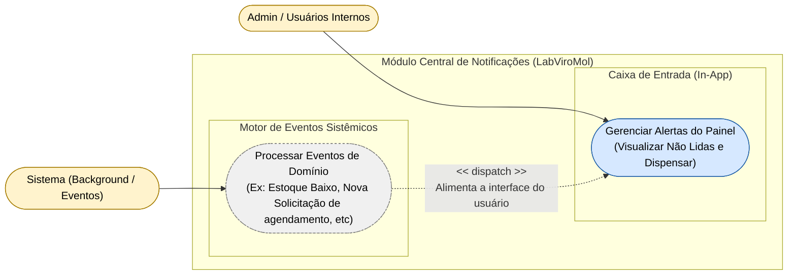

# Diagrama de Casos de Uso — Módulo Notify

[English](./use-case-diagram.md) · **Português**

Este documento apresenta o diagrama de casos de uso do módulo **Notify**. Cobre
as notificações internas, agrupadas em 2 capacidades: a caixa de entrada in-app consumida
pelo Admin (visualizar não lidas e dispensar) e o motor de eventos sistêmicos que processa
Domain Events de outros módulos e alimenta essa caixa de entrada. Interagem com este
módulo os atores **Admin** e **Sistema**.

**Relações cross-módulo recebidas de outros módulos** (não desenhadas aqui por
pertencerem ao diagrama de origem, listadas para referência): `Inventory.Gerenciar
Pedidos de Compra` e `Scheduling.Motor de Notificações` disparam
`Notify.Processar Eventos de Domínio` — ver as notas nas seções desses módulos.
