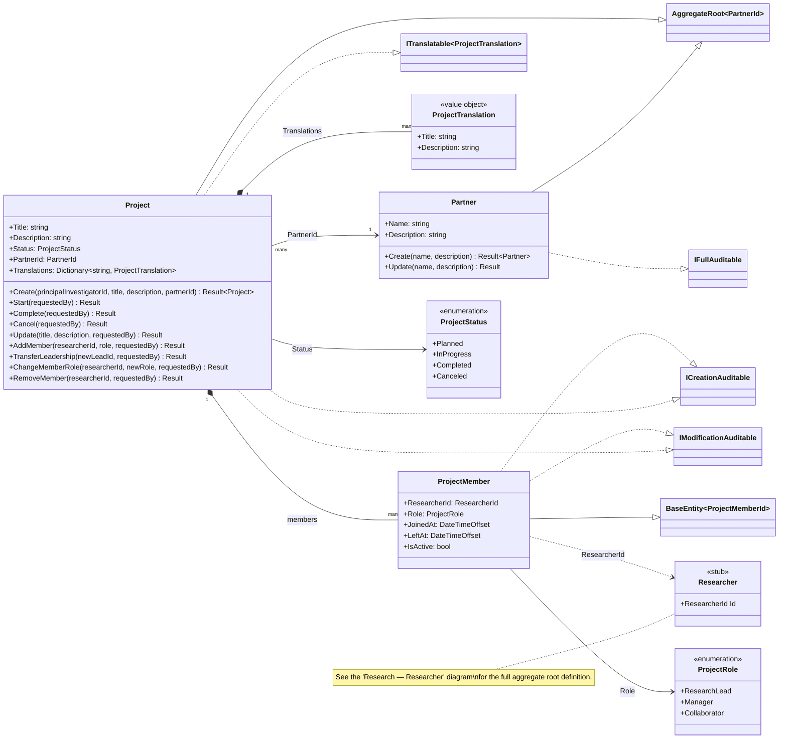
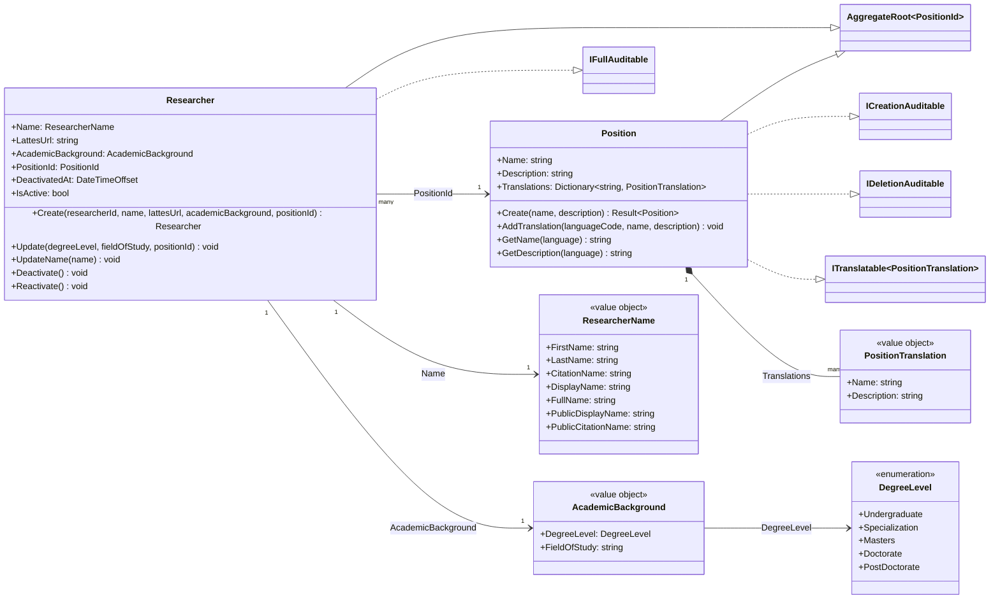
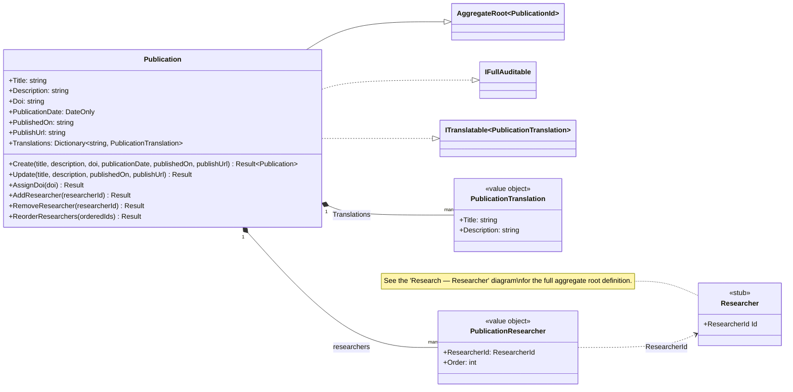

# Class Diagram — Research Module

**English** · [Português](./class-diagram.pt-BR.md)

This document presents the domain class diagrams of the **Research** module.
The module was modeled as **3 cohesive sub-diagrams** (Project, Researcher, Publication)
instead of a single block, since it is the densest grouping in the domain (14 classes and
4 intra-module FKs). `Researcher` is referenced by two of the three sub-diagrams (Project
and Publication) — in those cases it appears as a **stub** class (`<<stub>>`, Id only) with
a note pointing to the "Researcher" sub-diagram, which contains the full definition.

## Index

1. [Project](#project)
2. [Researcher](#researcher)
3. [Publication](#publication)

---

## Project

Covers the **Project** grouping: the aggregate root `Project`, its child entity
`ProjectMember` (composition), and the institutional partner `Partner`. `Researcher` is
referenced by `ProjectMember.ResearcherId`, but its full definition lives in the
[Researcher](#researcher) sub-diagram — here it appears only as a stub class to preserve
readability.

---

## Researcher

Covers the **Researcher** grouping: the aggregate root `Researcher` and the institutional
position `Position` it links to, together with the value objects and SmartEnums specific
to this grouping.

> `Researcher` is referenced, by Id, from `ProjectMember` (see
> [Project](#project)) and from `PublicationResearcher` (see
> [Publication](#publication)) — in both other
> sub-diagrams it appears only as a stub class.

---

## Publication

Covers the **Publication** grouping: the aggregate root `Publication` and its child entity
`PublicationResearcher` (composition, ordered list of authors). `Researcher` is referenced
by `PublicationResearcher.ResearcherId`, but its full definition lives in the
[Researcher](#researcher) sub-diagram.

