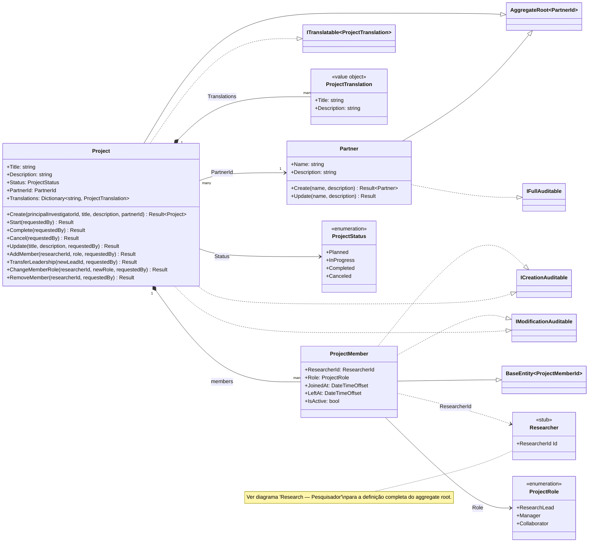
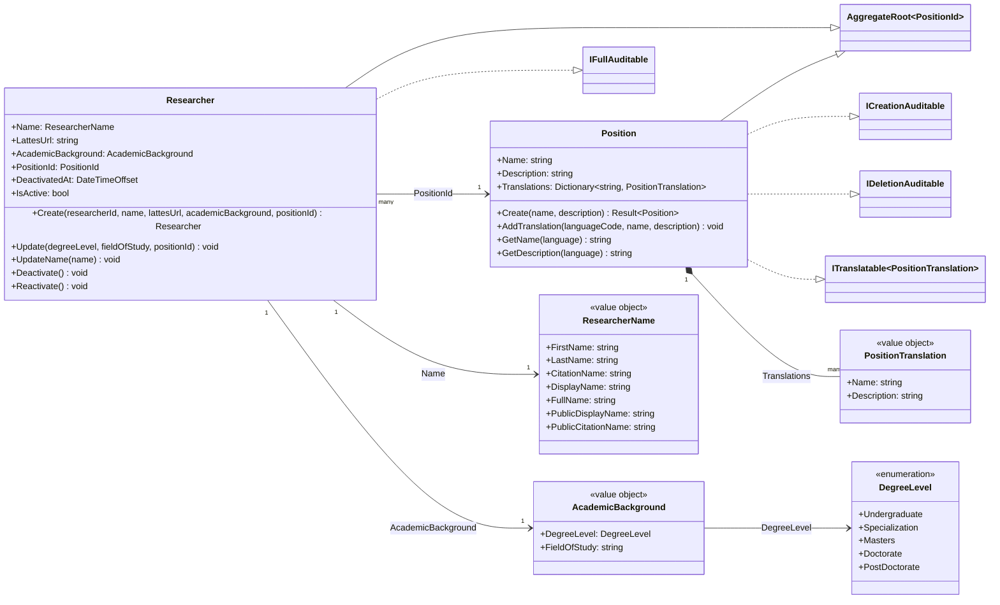
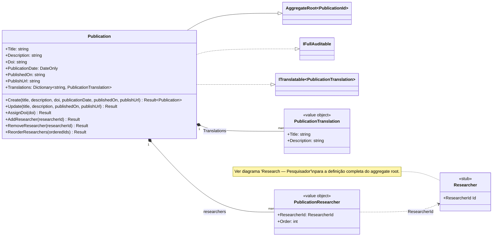

# Diagrama de Classes — Módulo Research

[English](./class-diagram.md) · **Português**

Este documento apresenta os diagramas de classes do domínio do módulo **Research**.
O módulo foi modelado em **3 sub-diagramas coesos** (Projeto, Pesquisador, Publicação) em
vez de um único bloco, por ser o agrupamento mais denso do domínio (14 classes e 4 FKs
intra-módulo). `Researcher` é referenciado por dois dos três sub-diagramas (Projeto e
Publicação) — nesses casos aparece como classe **stub** (`<<stub>>`, apenas Id) com nota
apontando para o sub-diagrama "Pesquisador", que contém a definição completa.

## Índice

1. [Projeto](#projeto)
2. [Pesquisador](#pesquisador)
3. [Publicação](#publicação)

---

## Projeto

Cobre o agrupamento de **Projeto**: o aggregate root `Project`, sua entidade filha
`ProjectMember` (composição) e o parceiro institucional `Partner`. `Researcher` é
referenciado por `ProjectMember.ResearcherId`, mas sua definição completa está no
sub-diagrama [Pesquisador](#pesquisador) — aqui ele aparece apenas como classe stub para
preservar a legibilidade.

---

## Pesquisador

Cobre o agrupamento de **Pesquisador**: o aggregate root `Researcher` e o cargo/posição
institucional `Position` ao qual ele se vincula, com os value objects e SmartEnums
específicos desse agrupamento.

> `Researcher` é referenciado, por Id, a partir de `ProjectMember` (ver
> [Projeto](#projeto)) e de `PublicationResearcher` (ver
> [Publicação](#publicação)) — em ambos os outros
> sub-diagramas ele aparece apenas como classe stub.

---

## Publicação

Cobre o agrupamento de **Publicação**: o aggregate root `Publication` e sua entidade
filha `PublicationResearcher` (composição, lista ordenada de autores). `Researcher` é
referenciado por `PublicationResearcher.ResearcherId`, mas sua definição completa está
no sub-diagrama [Pesquisador](#pesquisador).

