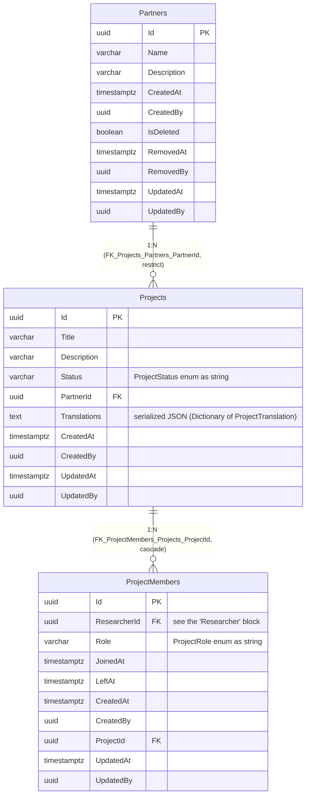
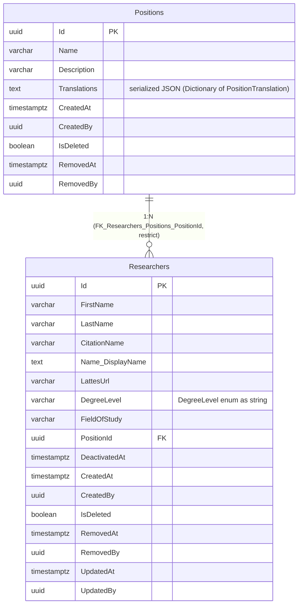
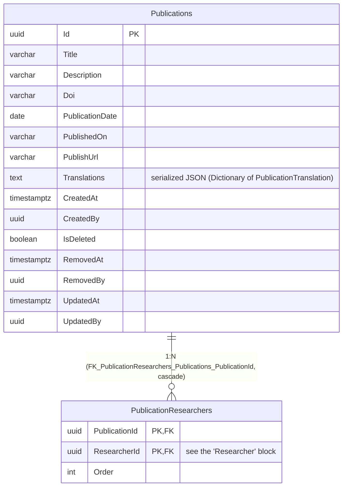

# Entity-Relationship Diagram — Research Module

**English** · [Português](./er-diagram.pt-BR.md)

This document presents the ER blocks of the `research` schema. DbContext:
`ResearchDbContext`. The schema was split into **3 cohesive sub-blocks** (Project,
Researcher, Publication) since it is the schema with the most tables (7) and the only one
with 4 intra-schema FK relationships crossing all tables with each other. The
`Researchers` table is referenced from two of the three sub-blocks (Project and
Publication) — in those cases it appears with the FK column annotated as usual, but
without the table's full definition, with a note pointing to the "Researcher" sub-block.

## Index

1. [Project](#project)
2. [Researcher](#researcher)
3. [Publication](#publication)

---

## Project

Sub-block of the `research` schema covering the **Project** grouping: `Partners`,
`Projects` and `ProjectMembers`. `ProjectMembers.ResearcherId` references `Researchers`,
detailed in the [Researcher](#researcher) sub-block — here it appears only as a column
reference, without the table's full definition.

> Note: `ProjectMembers.ResearcherId` has a real database FK constraint
> (`FK_ProjectMembers_Researchers_ResearcherId`, `ON DELETE RESTRICT`) pointing to
> `Researchers`, a table defined in the [Researcher](#researcher) sub-block — omitted here
> for readability, since it belongs to another cohesive grouping of the same schema.

---

## Researcher

Sub-block of the `research` schema covering the **Researcher** grouping: `Positions` and
`Researchers`.

> Note: `Researchers` is referenced, by a real database FK, from
> `ProjectMembers.ResearcherId` (see [Project](#project)) and from
> `PublicationResearchers.ResearcherId` (see [Publication](#publication)) — both
> `ON DELETE RESTRICT`, via migration (not yet applied in any environment).

---

## Publication

Sub-block of the `research` schema covering the **Publication** grouping: `Publications`
and `PublicationResearchers`. `PublicationResearchers.ResearcherId` references
`Researchers`, detailed in the [Researcher](#researcher) sub-block.

> Note: `PublicationResearchers.ResearcherId` has a real database FK constraint
> (`FK_PublicationResearchers_Researchers_ResearcherId`, `ON DELETE RESTRICT`) pointing to
> `Researchers`, a table defined in the [Researcher](#researcher) sub-block — omitted here
> for readability. All four intra-schema FKs of the Research module
> (`Researchers.PositionId`, `Projects.PartnerId`, `ProjectMembers.ResearcherId`,
> `PublicationResearchers.ResearcherId`) have not yet been applied in any environment.
