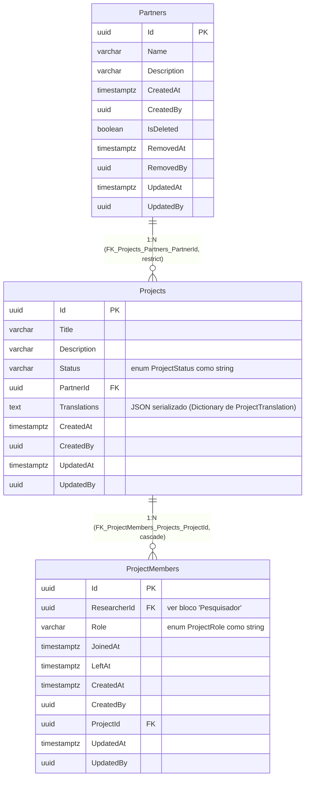
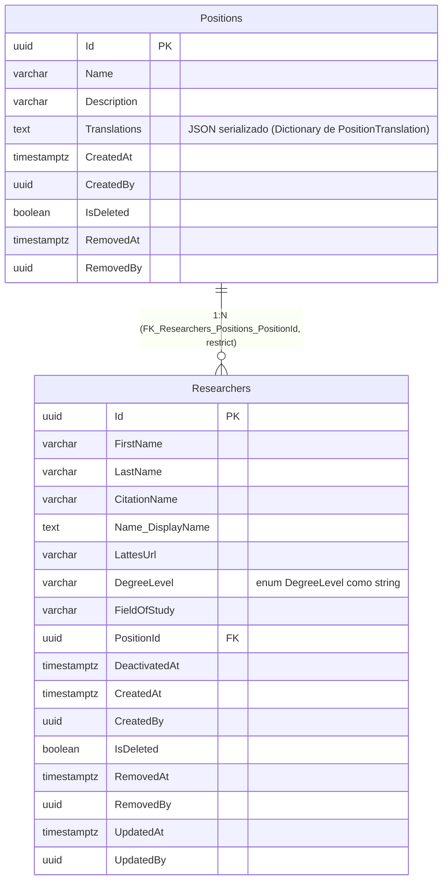
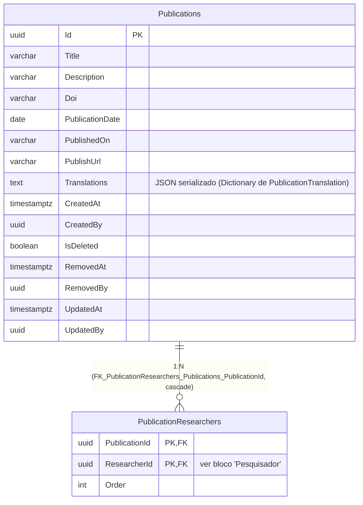

# Diagrama Entidade-Relacionamento — Módulo Research

[English](./er-diagram.md) · **Português**

Este documento apresenta os blocos ER do schema `research`. DbContext:
`ResearchDbContext`. O schema foi subdividido em **3 sub-blocos coesos** (Projeto,
Pesquisador, Publicação) por ser o schema com mais tabelas (7) e o único com 4 relações
de FK intra-schema cruzando todas as tabelas entre si. A tabela `Researchers` é
referenciada a partir de dois dos três sub-blocos (Projeto e Publicação) — nesses casos
ela aparece com a coluna de FK anotada normalmente, mas sem a definição completa da
tabela, com nota apontando para o sub-bloco "Pesquisador".

## Índice

1. [Projeto](#projeto)
2. [Pesquisador](#pesquisador)
3. [Publicação](#publicação)

---

## Projeto

Sub-bloco do schema `research` cobrindo o agrupamento de **Projeto**: `Partners`,
`Projects` e `ProjectMembers`. `ProjectMembers.ResearcherId` referencia `Researchers`,
detalhada no sub-bloco [Pesquisador](#pesquisador) — aqui ela aparece só como
referência de coluna, sem definição completa da tabela.

> Nota: `ProjectMembers.ResearcherId` tem constraint de FK real de banco
> (`FK_ProjectMembers_Researchers_ResearcherId`, `ON DELETE RESTRICT`) apontando para
> `Researchers`, tabela definida no sub-bloco
> [Pesquisador](#pesquisador) — omitida aqui por
> legibilidade, já que pertence a outro agrupamento coeso do mesmo schema.

---

## Pesquisador

Sub-bloco do schema `research` cobrindo o agrupamento de **Pesquisador**: `Positions` e
`Researchers`.

> Nota: `Researchers` é referenciada, por FK real de banco, a partir de
> `ProjectMembers.ResearcherId` (ver
> [Projeto](#projeto)) e de
> `PublicationResearchers.ResearcherId` (ver
> [Publicação](#publicação)) — ambas `ON DELETE RESTRICT`,
> via migration (ainda não aplicada em nenhum ambiente).

---

## Publicação

Sub-bloco do schema `research` cobrindo o agrupamento de **Publicação**: `Publications`
e `PublicationResearchers`. `PublicationResearchers.ResearcherId` referencia
`Researchers`, detalhada no sub-bloco [Pesquisador](#pesquisador).

> Nota: `PublicationResearchers.ResearcherId` tem constraint de FK real de banco
> (`FK_PublicationResearchers_Researchers_ResearcherId`, `ON DELETE RESTRICT`) apontando
> para `Researchers`, tabela definida no sub-bloco
> [Pesquisador](#pesquisador) — omitida aqui por
> legibilidade. Todas as quatro FKs intra-schema do módulo Research
> (`Researchers.PositionId`, `Projects.PartnerId`, `ProjectMembers.ResearcherId`,
> `PublicationResearchers.ResearcherId`) ainda não foram
> aplicadas em nenhum ambiente.
