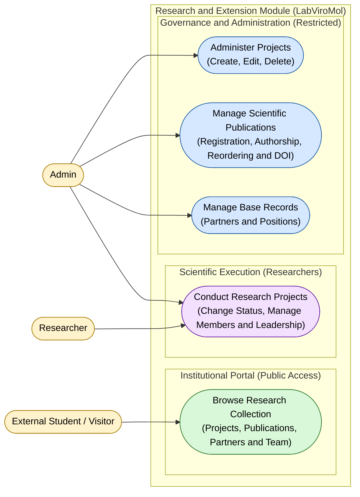

# Use Case Diagram — Research Module

**English** · [Português](./use-case-diagram.pt-BR.md)

This document presents the use case diagram of the **Research** module. It covers
the management of partners, positions, research projects, project members and
publications, grouped into 4 capabilities: public browsing of the institutional
collection, project conduction by researchers, project administration, and management
of publications/base records by the Admin. The actors interacting with this module are
**Admin**, **Researcher** and **External Student / Visitor**.

**Cross-module relations:**
- `Administer Projects` depends on `Identity.Perform Login / Logout` (authentication) —
 see the Context Map (`context-map.md`) for the integration mechanism.
