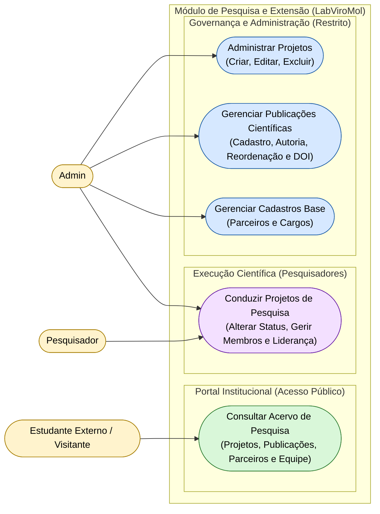

# Diagrama de Casos de Uso — Módulo Research

[English](./use-case-diagram.md) · **Português**

Este documento apresenta o diagrama de casos de uso do módulo **Research**. Cobre
a gestão de parceiros, posições/cargos, projetos de pesquisa, membros de projeto e
publicações, agrupados em 4 capacidades: consulta pública ao acervo institucional,
condução de projetos pelos pesquisadores, administração de projetos e gestão de
publicações/cadastros base pelo Admin. Interagem com este módulo os atores **Admin**,
**Pesquisador** e **Estudante Externo / Visitante**.

**Relações cross-módulo:**
- `Administrar Projetos` depende de `Identity.Realizar Login / Logout` (autenticação) —
 ver Mapa de Contexto (`context-map.md`) para o mecanismo de integração.
