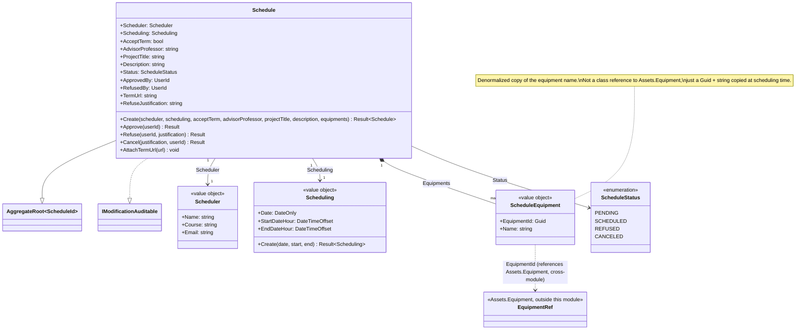

# Class Diagram — Scheduling Module

**English** · [Português](./class-diagram.pt-BR.md)

This document presents the domain class diagram specific to the **Scheduling** module. It covers exclusively the Domain layer: the aggregate root `Schedule`, the value objects `Scheduler`, `Scheduling` and `ScheduleEquipment`, and the `ScheduleStatus` enum.

