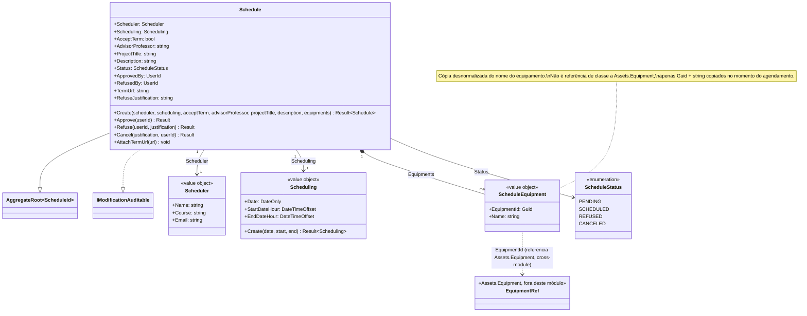

# Diagrama de Classes — Módulo Scheduling

[English](./class-diagram.md) · **Português**

Este documento apresenta o diagrama de classes de domínio específico do módulo **Scheduling**. Cobre exclusivamente a camada Domain: o aggregate root `Schedule`, os value objects `Scheduler`, `Scheduling` e `ScheduleEquipment`, e o enum `ScheduleStatus`.

