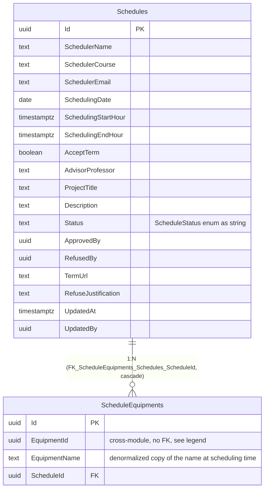

# Entity-Relationship Diagram — `scheduling` Schema

**English** · [Português](./er-diagram.pt-BR.md)

This document presents the block for the `scheduling` schema. It models the persistence layer (real physical tables) of the `Schedule` aggregate.

DbContext: `SchedulingDbContext`. `Schedule` implements only `IModificationAuditable`
(no `CreatedAt`/`CreatedBy` — the only aggregate in the system without creation auditing).

> Note: `Schedules` has no creation columns (`CreatedAt`/`CreatedBy`) nor soft
> delete — confirmed in the migration (`Schedule: IModificationAuditable` only, without
> `ICreationAuditable`/`IDeletionAuditable`). `ScheduleEquipments.EquipmentId` references
> `assets.Equipments` (another schema/module) with no database FK — just a copied Guid + name.
