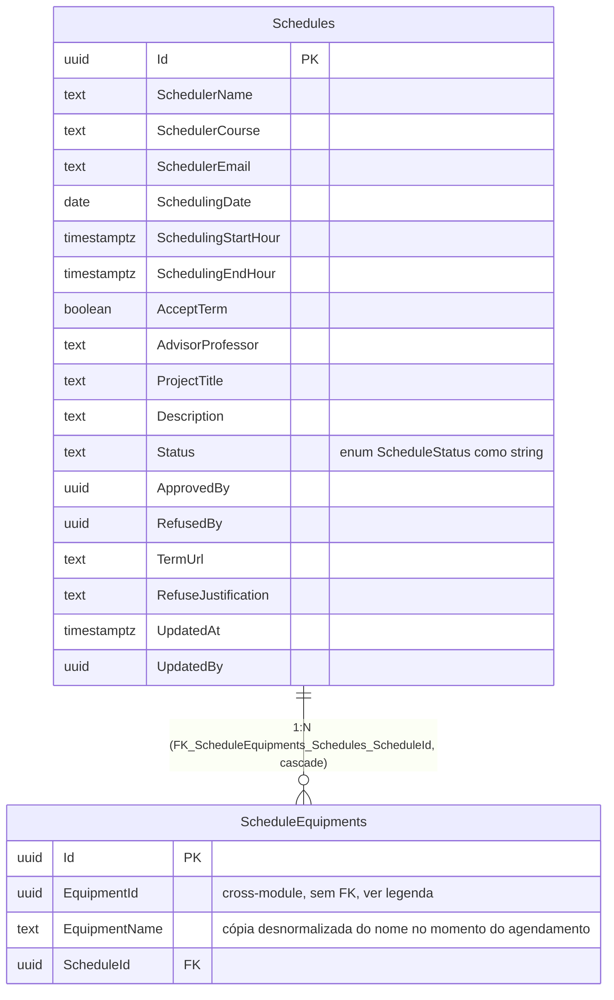

# Diagrama Entidade-Relacionamento — Schema `scheduling`

[English](./er-diagram.md) · **Português**

Este documento apresenta o bloco do schema `scheduling`. Modela a camada de persistência (tabelas físicas reais) do agregado `Schedule`.

DbContext: `SchedulingDbContext`. `Schedule` implementa apenas `IModificationAuditable`
(sem `CreatedAt`/`CreatedBy` — único agregado do sistema sem auditoria de criação).

> Nota: `Schedules` não possui colunas de criação (`CreatedAt`/`CreatedBy`) nem soft
> delete — confirmado na migration (`Schedule: IModificationAuditable` apenas, sem
> `ICreationAuditable`/`IDeletionAuditable`). `ScheduleEquipments.EquipmentId` referencia
> `assets.Equipments` (outro schema/módulo) sem FK de banco — apenas Guid + nome copiado.
