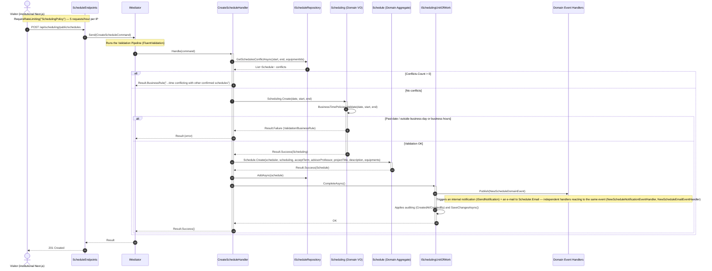
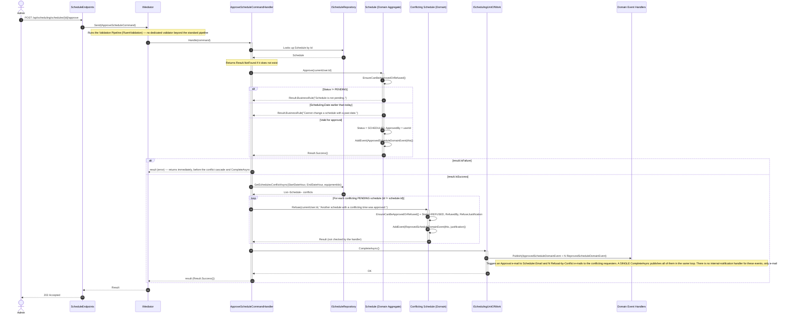
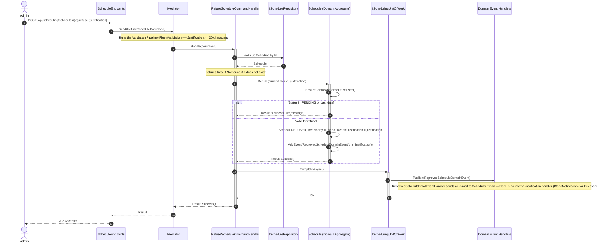
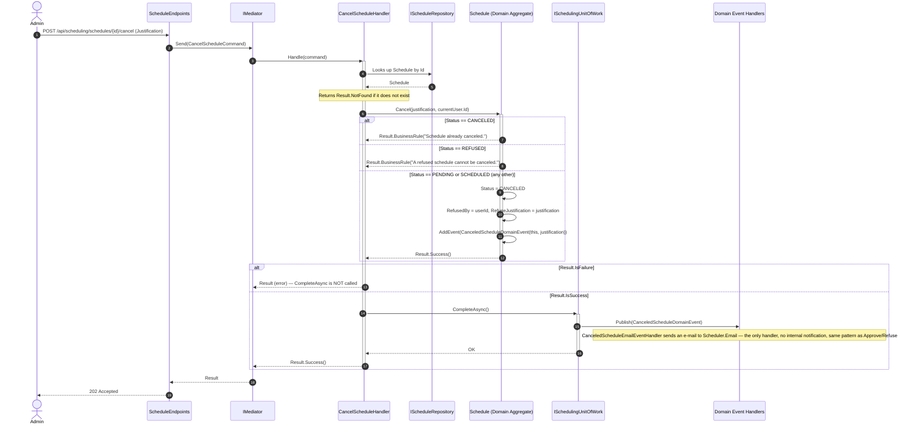

# Sequence Diagrams — Scheduling Module

**English** · [Português](./sequence-diagrams.pt-BR.md)

This document gathers the 4 sequence diagrams specific to the **Scheduling** module: Request Schedule, Approve Schedule, Refuse Schedule and Cancel Schedule. They cover the full lifecycle of the `Schedule` aggregate.

Conventions common to the diagrams (inherited from the source document):
- `autonumber` to reference steps during review.
- Solid arrows (`->>`) for synchronous calls, dashed (`-->>`) for returns.
- Lifeline activation via `+`/`-`.
- `alt`/`else` blocks for conditional business rules and state transitions.
- `loop` blocks for the domain event publication loop in `BaseUnitOfWork.CompleteAsync()`.
- `Note over` only for module boundaries and business rules that manifest as flow branching.
- The Domain Entity never interacts directly with the DbContext — only the Repository/UnitOfWork persists.
- The `Validator` (FluentValidation) does not appear as its own participant/lifeline: validation runs inside the `Mediator` pipeline (Behavior).
- Looking up an aggregate by Id followed by an existence check is simplified to a single lookup arrow + a `Returns Result.NotFound if it does not exist` note.

---

## 1. Request Schedule

Sources: `src/Modules/Scheduling/Presentation/Schedules/ScheduleEndpoints.cs` (`MapInstitutionalScheduleEndpoints`), `src/Modules/Scheduling/Presentation/SchedulingModule.cs` (composes the `/api/scheduling/public/schedules` route), `src/Modules/Scheduling/Application/Schedules/Commands/Create/{CreateScheduleCommand,CreateScheduleHandler,CreateScheduleValidator}.cs`, `src/Modules/Scheduling/Domain/Schedules/{Schedule,Scheduling}.cs`, `src/Modules/Scheduling/Domain/Schedules/Policies/BusinessTimePolicies.cs`, `src/Modules/Scheduling/Domain/Schedules/Events/NewScheduleDomainEvent.cs`, `src/Modules/Scheduling/Application/Schedules/EventHandlers/{NewScheduleNotificationEventHandler,NewScheduleEmailEventHandler}.cs`, `src/Modules/Notify/Contracts/ISendNotification.cs`, `src/Modules/Notify/Domain/Notifications/Notification.cs`.

**Highlighted business rule:** the private `Schedule.Create` constructor already sets `Status=PENDING` and calls `AddEvent(NewScheduleDomainEvent)`, but the actual publication of the event via Mediator only happens inside the `BaseUnitOfWork.CompleteAsync()` loop — there is, therefore, a gap between "event created" (in-memory buffer) and "event published". The time-conflict check (`GetSchedulesConflictAsync`) happens BEFORE any domain object is created, and the public endpoint is protected by rate limiting (5 requests/hour per IP).

---

## 2. Approve Schedule

Sources: `src/Modules/Scheduling/Presentation/Schedules/ScheduleEndpoints.cs`, `src/Modules/Scheduling/Application/Schedules/Commands/Approve/{ApproveScheduleCommand,ApproveScheduleCommandHandler}.cs`, `src/Modules/Scheduling/Domain/Schedules/Schedule.cs` (`EnsureCanBeApprovedOrRefused`, `Approve`), `src/Modules/Scheduling/Domain/Schedules/Events/{ApprovedScheduleDomainEvent,ReprovedScheduleDomainEvent}.cs`, `src/Modules/Scheduling/Application/Schedules/EventHandlers/{ApprovedScheduleEmailEventHandler,ReprovedScheduleEmailEventHandler}.cs`.

**Highlighted business rule:** when approving a schedule, `ApproveScheduleCommandHandler` only runs the conflict-refusal cascade (`RefuseConflictingSchedules` — looks up conflicts again via `GetSchedulesConflictAsync` and refuses all conflicting `PENDING` schedules) and calls `CompleteAsync()` if `Approve()` returned success; there is a guard `if (result.IsFailure) return result;` right after the call to `Approve`, which interrupts the flow before the cascade and the persistence in case of failure. When successful, `CompleteAsync()` publishes the `ApprovedScheduleDomainEvent` of the approved aggregate and all the `ReprovedScheduleDomainEvent`s of the refused conflicting ones in the same event loop.

---

## 3. Refuse Schedule

Sources: `src/Modules/Scheduling/Presentation/Schedules/ScheduleEndpoints.cs`, `src/Modules/Scheduling/Application/Schedules/Commands/Refuse/{RefuseScheduleCommand,RefuseScheduleCommandHandler,RefuseScheduleValidator}.cs`, `src/Modules/Scheduling/Domain/Schedules/Schedule.cs` (`EnsureCanBeApprovedOrRefused`, `Refuse`), `src/Modules/Scheduling/Domain/Schedules/Events/ReprovedScheduleDomainEvent.cs`, `src/Modules/Scheduling/Application/Schedules/EventHandlers/ReprovedScheduleEmailEventHandler.cs`.

**Highlighted business rule:** unlike the Approval flow (Diagram 2), a direct refusal does NOT trigger a cascade over other schedules — it affects only its own aggregate. `RefuseScheduleCommandHandler` calls `_unitOfWork.CompleteAsync()` even when `schedule.Refuse(...)` fails internally (the handler does not check the `Result` returned by `Refuse` before persisting, unlike the other handlers in this document), always returning `Result.Success()` to the Mediator.

---

## 4. Cancel Schedule

Sources: `src/Modules/Scheduling/Presentation/Schedules/ScheduleEndpoints.cs`, `src/Modules/Scheduling/Application/Schedules/Commands/Cancel/{CancelScheduleCommand,CancelScheduleHandler}.cs`, `src/Modules/Scheduling/Domain/Schedules/Schedule.cs` (`Cancel`), `src/Modules/Scheduling/Domain/Schedules/Events/CanceledScheduleDomainEvent.cs`, `src/Modules/Scheduling/Application/Schedules/EventHandlers/CanceledScheduleEmailEventHandler.cs`.

**Highlighted business rule:** `Schedule.Cancel` uses an exclusion rule DIFFERENT from `EnsureCanBeApprovedOrRefused` (used in Approve/Refuse) — it blocks only when `Status == CANCELED` or `Status == REFUSED`; any other status, including `PENDING` (not yet evaluated) and `SCHEDULED` (already approved), allows cancellation. The entity reuses the `RefusedBy`/`RefuseJustification` fields (the SAME ones used by `Refuse`, see Diagram 3) instead of having dedicated cancellation fields — there are no fields of its own for cancellation, a modeling decision that reduces the data surface but reuses semantics from another flow.
