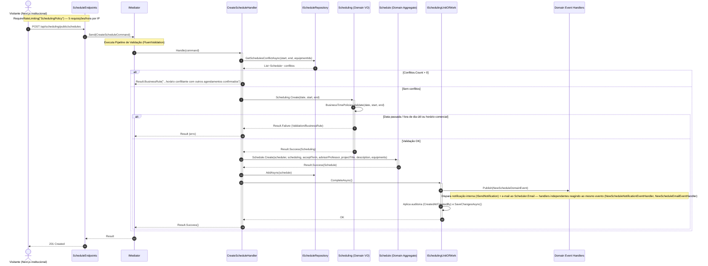
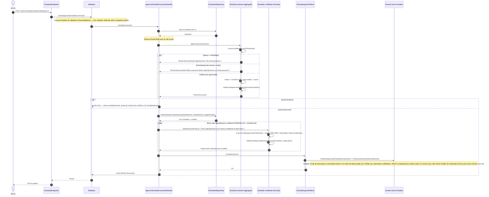
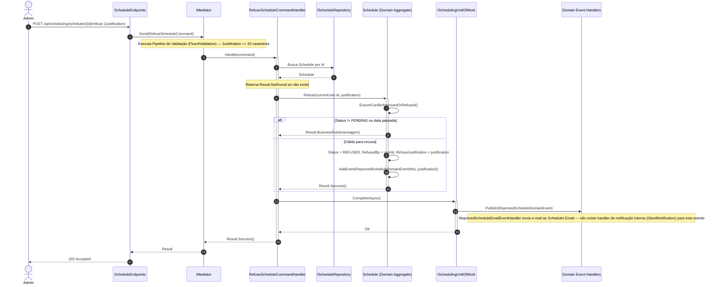
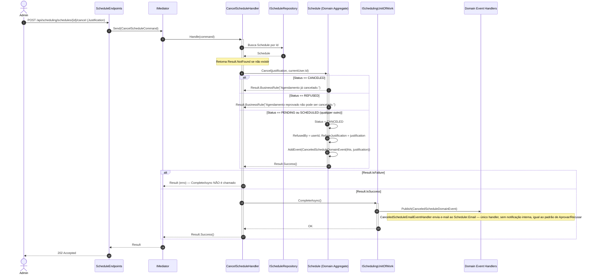

# Diagramas de Sequência — Módulo Scheduling

[English](./sequence-diagrams.md) · **Português**

Este documento reúne os 4 diagramas de sequência específicos do módulo **Scheduling**: Solicitar Agendamento, Aprovar Agendamento, Recusar Agendamento e Cancelar Agendamento. Cobrem o ciclo de vida completo do agregado `Schedule`.

Convenções comuns aos diagramas (herdadas do documento fonte):
- `autonumber` para referenciar passos durante revisão.
- Setas sólidas (`->>`) para chamadas síncronas, tracejadas (`-->>`) para retornos.
- Ativação de lifeline via `+`/`-`.
- Blocos `alt`/`else` para regras de negócio condicionais e transições de estado.
- Blocos `loop` para o laço de publicação de domain events em `BaseUnitOfWork.CompleteAsync()`.
- `Note over` apenas para fronteiras de módulo e regras de negócio que se manifestam como ramificação de fluxo.
- A Domain Entity nunca interage diretamente com o DbContext — apenas Repository/UnitOfWork persiste.
- O `Validator` (FluentValidation) não aparece como participante/lifeline própria: a validação roda dentro do pipeline do `Mediator` (Behavior).
- A busca de agregado por Id seguida de checagem de existência é simplificada para uma única seta de busca + nota `Retorna Result.NotFound se não existir`.

---

## 1. Solicitar Agendamento

Fontes: `src/Modules/Scheduling/Presentation/Schedules/ScheduleEndpoints.cs` (`MapInstitutionalScheduleEndpoints`), `src/Modules/Scheduling/Presentation/SchedulingModule.cs` (compõe a rota `/api/scheduling/public/schedules`), `src/Modules/Scheduling/Application/Schedules/Commands/Create/{CreateScheduleCommand,CreateScheduleHandler,CreateScheduleValidator}.cs`, `src/Modules/Scheduling/Domain/Schedules/{Schedule,Scheduling}.cs`, `src/Modules/Scheduling/Domain/Schedules/Policies/BusinessTimePolicies.cs`, `src/Modules/Scheduling/Domain/Schedules/Events/NewScheduleDomainEvent.cs`, `src/Modules/Scheduling/Application/Schedules/EventHandlers/{NewScheduleNotificationEventHandler,NewScheduleEmailEventHandler}.cs`, `src/Modules/Notify/Contracts/ISendNotification.cs`, `src/Modules/Notify/Domain/Notifications/Notification.cs`.

**Regra de negócio em destaque:** o construtor privado de `Schedule.Create` já define `Status=PENDING` e chama `AddEvent(NewScheduleDomainEvent)`, mas a publicação real do evento via Mediator só acontece dentro do loop de `BaseUnitOfWork.CompleteAsync()` — há, portanto, uma defasagem entre "evento criado" (buffer em memória) e "evento publicado". A checagem de conflito de horário (`GetSchedulesConflictAsync`) ocorre ANTES de qualquer criação de objeto de domínio, e o endpoint público está protegido por rate limiting (5 requisições/hora por IP).

---

## 2. Aprovar Agendamento

Fontes: `src/Modules/Scheduling/Presentation/Schedules/ScheduleEndpoints.cs`, `src/Modules/Scheduling/Application/Schedules/Commands/Approve/{ApproveScheduleCommand,ApproveScheduleCommandHandler}.cs`, `src/Modules/Scheduling/Domain/Schedules/Schedule.cs` (`EnsureCanBeApprovedOrRefused`, `Approve`), `src/Modules/Scheduling/Domain/Schedules/Events/{ApprovedScheduleDomainEvent,ReprovedScheduleDomainEvent}.cs`, `src/Modules/Scheduling/Application/Schedules/EventHandlers/{ApprovedScheduleEmailEventHandler,ReprovedScheduleEmailEventHandler}.cs`.

**Regra de negócio em destaque:** ao aprovar um agendamento, o `ApproveScheduleCommandHandler` só executa a cascata de recusa de conflitos (`RefuseConflictingSchedules` — busca novamente conflitos via `GetSchedulesConflictAsync` e recusa todos os agendamentos `PENDING` conflitantes) e chama `CompleteAsync()` se `Approve()` tiver retornado sucesso; há uma guarda `if (result.IsFailure) return result;` logo após a chamada a `Approve`, que interrompe o fluxo antes da cascata e da persistência em caso de falha. Quando bem-sucedido, `CompleteAsync()` publica o `ApprovedScheduleDomainEvent` do agregado aprovado e todos os `ReprovedScheduleDomainEvent` dos conflitantes recusados no mesmo loop de eventos.

---

## 3. Recusar Agendamento

Fontes: `src/Modules/Scheduling/Presentation/Schedules/ScheduleEndpoints.cs`, `src/Modules/Scheduling/Application/Schedules/Commands/Refuse/{RefuseScheduleCommand,RefuseScheduleCommandHandler,RefuseScheduleValidator}.cs`, `src/Modules/Scheduling/Domain/Schedules/Schedule.cs` (`EnsureCanBeApprovedOrRefused`, `Refuse`), `src/Modules/Scheduling/Domain/Schedules/Events/ReprovedScheduleDomainEvent.cs`, `src/Modules/Scheduling/Application/Schedules/EventHandlers/ReprovedScheduleEmailEventHandler.cs`.

**Regra de negócio em destaque:** diferente do fluxo de Aprovação (Diagrama 2), a recusa direta NÃO desencadeia cascata sobre outros agendamentos — afeta apenas o próprio agregado. O `RefuseScheduleCommandHandler` chama `_unitOfWork.CompleteAsync()` mesmo quando `schedule.Refuse(...)` falha internamente (o handler não verifica o `Result` retornado por `Refuse` antes de persistir, ao contrário dos demais handlers deste documento), retornando sempre `Result.Success()` ao Mediator.

---

## 4. Cancelar Agendamento

Fontes: `src/Modules/Scheduling/Presentation/Schedules/ScheduleEndpoints.cs`, `src/Modules/Scheduling/Application/Schedules/Commands/Cancel/{CancelScheduleCommand,CancelScheduleHandler}.cs`, `src/Modules/Scheduling/Domain/Schedules/Schedule.cs` (`Cancel`), `src/Modules/Scheduling/Domain/Schedules/Events/CanceledScheduleDomainEvent.cs`, `src/Modules/Scheduling/Application/Schedules/EventHandlers/CanceledScheduleEmailEventHandler.cs`.

**Regra de negócio em destaque:** `Schedule.Cancel` usa uma regra de exclusão DIFERENTE de `EnsureCanBeApprovedOrRefused` (usada em Aprovar/Recusar) — bloqueia apenas `Status == CANCELED` ou `Status == REFUSED`; qualquer outro status, incluindo `PENDING` (ainda não avaliado) e `SCHEDULED` (já aprovado), permite o cancelamento. A entidade reaproveita os campos `RefusedBy`/`RefuseJustification` (os MESMOS usados por `Refuse`, ver Diagrama 3) em vez de ter campos dedicados a cancelamento — não há campos próprios de cancelamento, uma decisão de modelagem que reduz a superfície de dados, mas reaproveita semântica de outro fluxo.
