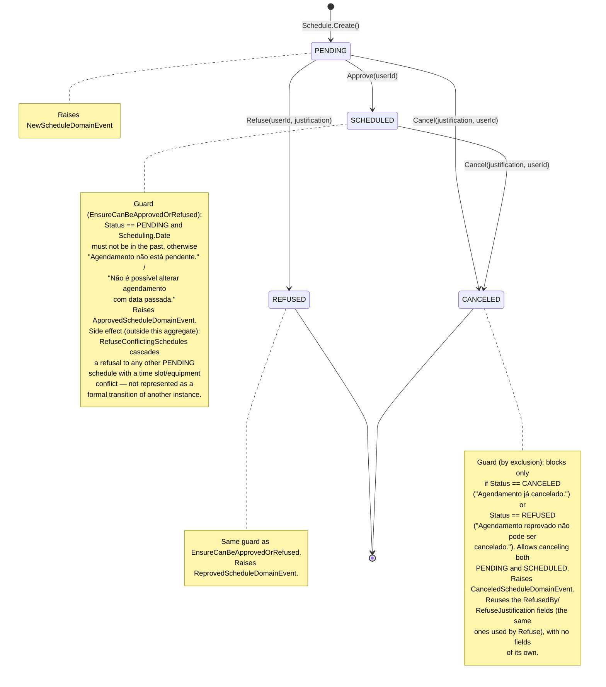

# State Diagram — Schedule (Scheduling Module)

**English** · [Português](./state-diagram.pt-BR.md)

This document presents the state diagram of the `Schedule` aggregate.

Sources: `src/Modules/Scheduling/Domain/Schedules/Schedule.cs`, `src/Modules/Scheduling/Domain/Schedules/ScheduleStatus.cs`, handlers in `src/Modules/Scheduling/Application/Schedules/Commands/{Approve,Refuse,Cancel}/`.

`ScheduleStatus` has 4 states: `PENDING`, `SCHEDULED`, `REFUSED`, `CANCELED`. `REFUSED` and `CANCELED` are terminal states. `Approve` and `Refuse` share the same guard (`EnsureCanBeApprovedOrRefused`); `Cancel` uses an independent guard, based on state exclusion.

**Reading guide**: every schedule is born `PENDING` and awaits a decision. The decision is binary and terminal in one of two directions: `Refuse` leads to `REFUSED` (terminal, no way back) or `Approve` leads to `SCHEDULED`. From either `PENDING` or `SCHEDULED`, `Cancel` is always possible and leads to `CANCELED` (terminal) — the only blocked combination is canceling something that is already `CANCELED` or `REFUSED`. The cascading effect of `Approve` on other `Schedule` instances is documented as a note because the state diagram represents a single aggregate instance, not an interaction diagram between aggregates.
