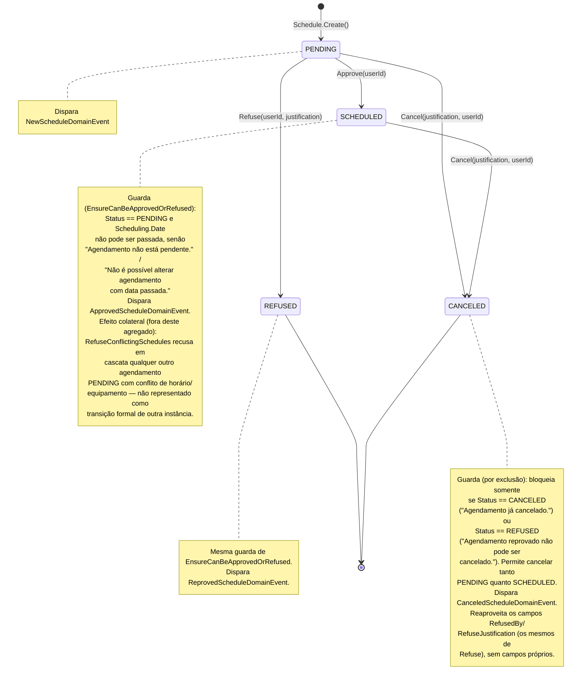

# Diagrama de Estado — Schedule (Módulo Scheduling)

[English](./state-diagram.md) · **Português**

Este documento apresenta o diagrama de estado do agregado `Schedule`.

Fontes: `src/Modules/Scheduling/Domain/Schedules/Schedule.cs`, `src/Modules/Scheduling/Domain/Schedules/ScheduleStatus.cs`, Handlers em `src/Modules/Scheduling/Application/Schedules/Commands/{Approve,Refuse,Cancel}/`.

`ScheduleStatus` tem 4 estados: `PENDING`, `SCHEDULED`, `REFUSED`, `CANCELED`. `REFUSED` e `CANCELED` são estados terminais. `Approve` e `Refuse` compartilham a mesma guarda (`EnsureCanBeApprovedOrRefused`); `Cancel` usa uma guarda independente, por exclusão de estados.

**Guia de leitura**: todo agendamento nasce `PENDING` e aguarda decisão. A decisão é binária e terminal em um dos sentidos: `Refuse` leva a `REFUSED` (terminal, sem volta) ou `Approve` leva a `SCHEDULED`. A partir de `PENDING` ou `SCHEDULED`, `Cancel` é sempre possível e leva a `CANCELED` (terminal) — a única combinação bloqueada é cancelar algo que já está `CANCELED` ou `REFUSED`. O efeito cascata de `Approve` sobre outras instâncias de `Schedule` é documentado como nota porque o diagrama de estado é por instância de agregado, não um diagrama de interação entre agregados.
